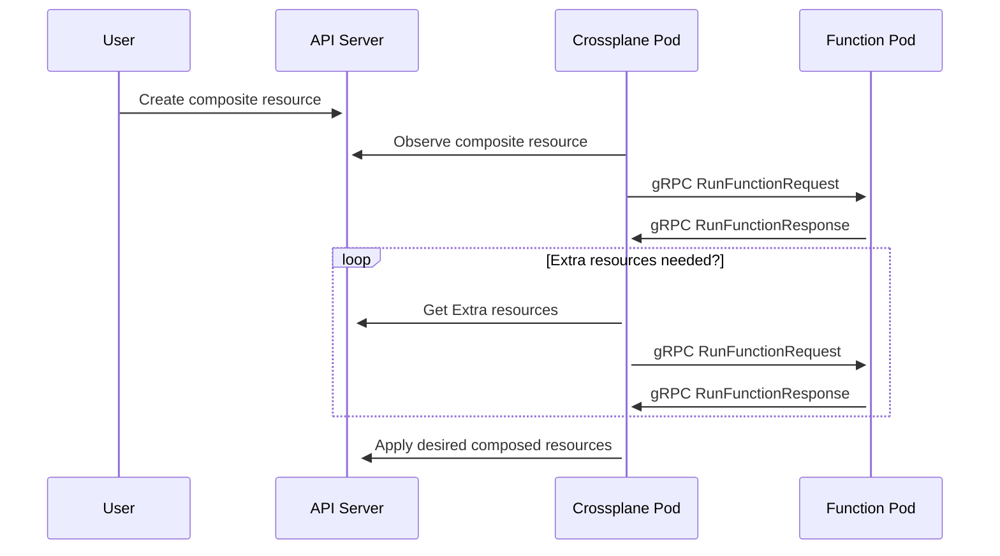

Compositions are a template for creating multiple Kubernetes resources as a
single _composite_ resource.

A Composition _composes_ individual resources together into a larger, reusable,
solution.

An example Composition may combine a virtual machine, storage resources and
networking policies. A Composition template links all these individual
resources together.

Here's an example Composition. When you create an
AcmeBucket composite resource
(XR) that uses this Composition, Crossplane uses the template to create the
Amazon S3 Bucket managed
resource.

```yaml {label="intro"}
apiVersion: apiextensions.crossplane.io/v1
kind: Composition
metadata:
  name: example
spec:
  compositeTypeRef:
    apiVersion: custom-api.example.org/v1alpha1
    kind: AcmeBucket
  mode: Pipeline
  pipeline:
  - step: patch-and-transform
    functionRef:
      name: function-patch-and-transform
    input:
      apiVersion: pt.fn.crossplane.io/v1beta1
      kind: Resources
      resources:
      - name: storage-bucket
        base:
          apiVersion: s3.aws.m.upbound.io/v1beta1
          kind: Bucket
          spec:
            forProvider:
              region: "us-east-2"
```



A [composite resource]() or XR is a custom API.

You use two Crossplane types to create a new custom API:

* A [Composite Resource Definition]()
  (XRD) - Defines the XR's schema. 
* A Composition - This page. Configures how the XR creates other resources.


## Create a composition

Creating a Composition consists of:
* [Using composition functions](#use-a-function-in-a-composition) to define the
  resources to create.
* [Enabling composite resources](#match-composite-resources) to use the
  Composition template.

A Composition is a pipeline of composition functions.

Composition functions (or just functions, for short) are Crossplane extensions
that template Crossplane resources. Crossplane calls the composition functions
to determine what resources it should create when you create a composite
resource (XR).


Crossplane has functions that let you template composed resources using YAML
[patch and transforms]().
Helm-like
[YAML templates](https://github.com/crossplane-contrib/function-go-templating),
[CUE](https://github.com/crossplane-contrib/function-cue),
[KCL](https://github.com/crossplane-contrib/function-kcl), or
[Python](https://github.com/crossplane-contrib/function-python).

You can also [write your own function](#write-a-composition-function) using Go
or Python.


### Install a composition function

Installing a Function creates a function pod. Crossplane sends requests to this
pod to ask it what resources to create when you create a composite resource.

Install a Function with a Crossplane
Function object setting the
spec.package value to the
location of the function package.


For example, to install [Function Patch and Transform](),

```yaml {label="install"}
apiVersion: pkg.crossplane.io/v1
kind: Function
metadata:
  name: function-patch-and-transform
spec:
  package: xpkg.crossplane.io/crossplane-contrib/function-patch-and-transform:v0.8.2
```


Functions are Crossplane Packages. Read more about Packages in the
[Packages documentation]().


By default, the Function pod installs in the same namespace as Crossplane
(`crossplane-system`).

### Verify a composition function

View the status of a Function with `kubectl get functions`

During the install a Function reports `INSTALLED` as `True` and `HEALTHY` as
`Unknown`.

```shell {copy-lines="1"}
kubectl get functions
NAME                              INSTALLED   HEALTHY   PACKAGE                                                                  AGE
function-patch-and-transform      True        Unknown   xpkg.crossplane.io/crossplane-contrib/function-patch-and-transform:v0.8.2   10s
```

After the Function install completes and it's ready for use the `HEALTHY` status
reports `True`.

### Use a function in a composition

Crossplane calls a Function to determine what resources it should create when
you create a composite resource. The Function also tells Crossplane what to do
with these resources when you update a composite resource.


Composition functions don't run when you delete a composite resource.
Crossplane handles deletion of composed resources automatically.


When Crossplane calls a Function it sends it the current state of the composite
resource. It also sends it the current state of any resources the composite
resource owns.

Crossplane knows what Function to call when a composite resource changes by
looking at the Composition the composite resource uses.

To use composition functions set the Composition
mode to
Pipeline.

Define a pipeline of
steps. Each
step calls a Function.

Each step uses a
functionRef to reference the
name of the Function to call.

Some Functions also allow you to specify an
input.
The function defines the
kind of input.

This example uses
[Function Patch and Transform]().
Function Patch and Transform implements Crossplane resource
templates.
The input kind is Resources,
and it accepts  resources as input.

```yaml {label="single",copy-lines="none"}
apiVersion: apiextensions.crossplane.io/v1
kind: Composition
# Removed for Brevity
spec:
  # Removed for Brevity
  mode: Pipeline
  pipeline:
  - step: patch-and-transform
    functionRef:
      name: function-patch-and-transform
    input:
      apiVersion: pt.fn.crossplane.io/v1beta1
      kind: Resources
      resources:
      - name: storage-bucket
        base:
          apiVersion: s3.aws.m.upbound.io/v1beta1
          kind: Bucket
          spec:
            forProvider:
              region: "us-east-2"
```

### Use a pipeline of functions in a composition

Crossplane can ask more than one Function what to do when a composite resource
changes. When a Composition has a pipeline of two or more steps, Crossplane
calls them all. It calls them in the order they appear in the pipeline.

Crossplane passes each Function in the pipeline the result of the previous
Function. This enables powerful combinations of Functions. In this example,
Crossplane calls function-cue to
create an S3 bucket. Crossplane then passes the bucket to
function-auto-ready, which marks the
composite resource as ready when the bucket becomes ready.

```yaml {label="double",copy-lines="none"}
apiVersion: apiextensions.crossplane.io/v1
kind: Composition
# Removed for Brevity
spec:
  # Removed for Brevity
  mode: Pipeline
  pipeline:
  - step: cue-export-resources
    functionRef:
      name: function-cue
    input:
      apiVersion: cue.fn.crossplane.io/v1beta1
      kind: CUEInput
      name: storage-bucket
      export:
        target: Resources
        value: |
          apiVersion: "s3.aws.m.upbound.io/v1beta1"
          kind: "Bucket"
          spec: forProvider: region: "us-east-2"
  - step: automatically-detect-readiness
    functionRef:
      name: function-auto-ready
```


### Match composite resources

A Composition is only a template defining how to create composed resources. A
Composition limits which kind of composite resource (XR) can use this template.

A Composition's compositeTypeRef
defines which Composite Resource type can use this Composition.


Read more about Composite Resources in the
[Composite Resources page]().


Inside a Composition's
spec
define the Composite Resource
apiVersion and
kind
that the Composition allows to use this template.

```yaml {label="typeref",copy-lines="none"}
apiVersion: apiextensions.crossplane.io/v1
kind: Composition
metadata:
  name: dynamodb-with-bucket
spec:
  compositeTypeRef:
    apiVersion: custom-api.example.org/v1alpha1
    kind: database
  # Removed for brevity
```

### Grant access to composed resources

Crossplane uses its [service account](https://kubernetes.io/docs/concepts/security/service-accounts/)
to create the composed resources that a function pipeline returns.

Crossplane's service account has access to create, update, and delete any
resource installed by a [provider](), or
defined by an XRD. This includes all
[MRs]() and
[XRs](). It also has access to some types of
Kubernetes resources that it needs to function - for example it can create
deployments.

You must grant Crossplane access to compose any other kind of resource. You do
this by creating an [RBAC ClusterRole](https://kubernetes.io/docs/reference/access-authn-authz/rbac/).

<!-- vale write-good.TooWordy = NO -->
<!-- TooWordy thinks "aggregate" is too wordy, but it's the name of the concept. -->
The ClusterRole must aggregate to Crossplane's primary ClusterRole using
[ClusterRole aggregation](https://kubernetes.io/docs/reference/access-authn-authz/rbac/#aggregated-clusterroles).
<!-- vale write-good.TooWordy = YES -->

Here's a ClusterRole that grants Crossplane access to manage
[CloudNativePG](https://cloudnative-pg.io) PostgreSQL clusters.

``` yaml
apiVersion: rbac.authorization.k8s.io/v1
kind: ClusterRole
metadata:
  name: cnpg:aggregate-to-crossplane
  labels:
    rbac.crossplane.io/aggregate-to-crossplane: "true"
rules:
- apiGroups:
  - postgresql.cnpg.io
  resources:
  - clusters
  verbs:
  - "*"
```

<!-- vale write-good.TooWordy = NO -->
<!-- TooWordy thinks "aggregate" is too wordy, but it's the name of the concept. -->
The `rbac.crossplane.io/aggregate-to-crossplane: "true"` label is critical. It
configures the role to aggregate to Crossplane's primary cluster role.
<!-- vale write-good.TooWordy = YES -->


The [RBAC manager]() automatically
grants Crossplane access to MRs and XRs. The RBAC manager uses
[escalate access](https://kubernetes.io/docs/concepts/security/rbac-good-practices/#escalate-verb)
to grant Crossplane access that the RBAC manager doesn't have.

The RBAC manager is an optional Crossplane component that's enabled by default.
**If you disable the RBAC manager, you must manually grant Crossplane access to
_any_ kind of resource you wish to compose - including XRs and MRs.**


## Test a composition

You can preview the output of any composition using the Crossplane CLI. You
don't need a Crossplane control plane to do this. The Crossplane CLI uses Docker
Engine to run functions.


See the [Crossplane CLI docs]() to
learn how to install and use the Crossplane CLI.



Running `crossplane render` requires [Docker](https://www.docker.com).


Provide a composite resource, composition and composition functions to render
the output locally.

```shell
crossplane render xr.yaml composition.yaml functions.yaml
```

`crossplane render` prints resources as YAML to stdout. It prints the
composite resource first, followed by the resources the composition functions
created.

```yaml
---
apiVersion: example.crossplane.io/v1
kind: Bucket
metadata:
  name: example-render
---
apiVersion: s3.aws.m.upbound.io/v1beta1
kind: Bucket
metadata:
  annotations:
    crossplane.io/composition-resource-name: storage-bucket
  generateName: example-render-
  labels:
    crossplane.io/composite: example-render
  ownerReferences:
  - apiVersion: example.crossplane.io/v1
    blockOwnerDeletion: true
    controller: true
    kind: Bucket
    name: example-render
    uid: ""
spec:
  forProvider:
    region: us-east-2
```



You can recreate the output below by running `crossplane render` with
these files.

The `xr.yaml` file contains the composite resource to render:

```yaml
apiVersion: example.crossplane.io/v1
kind: Bucket
metadata:
  name: example-render
spec:
  bucketRegion: us-east-2
```

The `composition.yaml` file contains the Composition to use to render the
composite resource:

```yaml
apiVersion: apiextensions.crossplane.io/v1
kind: Composition
metadata:
  name: example-render
spec:
  compositeTypeRef:
    apiVersion: example.crossplane.io/v1
    kind: Bucket
  mode: Pipeline
  pipeline:
  - step: patch-and-transform
    functionRef:
      name: function-patch-and-transform
    input:
      apiVersion: pt.fn.crossplane.io/v1beta1
      kind: Resources
      resources:
      - name: storage-bucket
        base:
          apiVersion: s3.aws.m.upbound.io/v1beta1
          kind: Bucket
        patches:
        - type: FromCompositeFieldPath
          fromFieldPath: spec.bucketRegion
          toFieldPath: spec.forProvider.region
```

The `functions.yaml` file contains the Functions the Composition references in
its pipeline steps:

```yaml
---
apiVersion: pkg.crossplane.io/v1
kind: Function
metadata:
  name: function-patch-and-transform
spec:
  package: xpkg.crossplane.io/crossplane-contrib/function-patch-and-transform:v0.8.2
```


The Crossplane CLI uses Docker Engine to run functions. You can change how the
Crossplane CLI runs a function by adding an annotation in `functions.yaml`. Add
the `render.crossplane.io/runtime` annotation to a Function to change how it's
run.

`crossplane render` supports two `render.crossplane.io/runtime` values:

* `Docker` (the default) connects to Docker Engine. It uses Docker to pull and
  run a function runtime.
* `Development` connects to a function runtime you have run manually.

When you use the Development
runtime the Crossplane CLI ignores the Function's package. Instead it expects you to make sure the function
is listening on localhost port 9443. The function must be listening without gRPC
transport security. Most function SDKs let you run a function with the
`--insecure` flag to disable transport security. For example you can run a Go
function locally using `go run . --insecure`.

```yaml {label="development"}
apiVersion: pkg.crossplane.io/v1
kind: Function
metadata:
  name: function-patch-and-transform
  annotations:
    render.crossplane.io/runtime: Development
spec:
  package: xpkg.crossplane.io/crossplane-contrib/function-patch-and-transform:v0.8.2
```


Use the `Development` runtime when you
[write a composition function](#write-a-composition-function) to test your
function end-to-end.


`crossplane render` also supports the following Function annotations. These
annotations affect how it runs Functions:

* `render.crossplane.io/runtime-docker-cleanup` - When using the `Docker`
runtime this annotation specifies whether the CLI should stop the function
container after it calls the function. It supports the values `Stop`, to stop
the container, and `Orphan`, to leave it running.
* `render.crossplane.io/runtime-docker-pull-policy` - When using the `Docker`
  runtime this annotation specifies when the CLI should pull the Function's
  package. It supports the values `Always`, `Never`, and `IfNotPresent`.
* `render.crossplane.io/runtime-development-target` - When using the
  `Development` runtime this annotation tells the CLI to connect to a Function
  running at the specified target. It uses
  [gRPC target syntax](https://github.com/grpc/grpc/blob/v1.59.1/doc/naming.md).

## Verify a composition

View all available Compositions with `kubectl get composition`.

```shell {copy-lines="1"}
kubectl get composition
NAME                                       XR-KIND        XR-APIVERSION                         AGE
xapps.aws.platformref.upbound.io           XApp           aws.platformref.upbound.io/v1alpha1   123m
xclusters.aws.platformref.upbound.io       XCluster       aws.platformref.upbound.io/v1alpha1   123m
xeks.aws.platformref.upbound.io            XEKS           aws.platformref.upbound.io/v1alpha1   123m
xnetworks.aws.platformref.upbound.io       XNetwork       aws.platformref.upbound.io/v1alpha1   123m
xservices.aws.platformref.upbound.io       XServices      aws.platformref.upbound.io/v1alpha1   123m
xsqlinstances.aws.platformref.upbound.io   XSQLInstance   aws.platformref.upbound.io/v1alpha1   123m
```

The `XR-KIND` lists the Composite Resource `kind` that's allowed to use the
Composition template.
The `XR-APIVERSION` lists the Composite Resource API versions allowed to use the
Composition template.


The output of `kubectl get composition` is different than `kubectl get
composite`.

`kubectl get composition` lists all available Compositions.

`kubectl get composite` lists all created Composite Resources and their related
Composition.


## Write a composition function

Composition functions let you replace complicated Compositions with code written
in your programming language of choice. Crossplane has tools, software
development kits (SDKs) and templates to help you write a function.


<!-- vale write-good.Passive = NO -->
Here's an example of a tiny, hello world function. This example uses
[Go](https://go.dev).
<!-- vale write-good.Passive = YES -->

```go
func (f *Function) RunFunction(_ context.Context, req *fnv1.RunFunctionRequest) (*fnv1.RunFunctionResponse, error) {
        rsp := response.To(req, response.DefaultTTL)
        response.Normal(rsp, "Hello world!")
        return rsp, nil
}
```

Crossplane has [language specific guides]() to writing a
composition function. Refer to the guide for your preferred language to learn
how to write a composition function.

When you're writing a composition function it's useful to know how composition
functions work. Read the next section to learn
[how composition functions work](#how-composition-functions-work).

## How composition functions work

Each composition function is actually a [gRPC](https://grpc.io) server. gRPC is
a high performance, open source remote procedure call (RPC) framework. When you
[install a function](#install-a-composition-function) Crossplane deploys the
function as a gRPC server. Crossplane encrypts and authenticates all gRPC
communication.

You don't have to be a gRPC expert to write a function. Crossplane's function
SDKs setup gRPC for you. It's useful to understand how Crossplane calls your
function though, and how your function should respond.



When you create or update a composite resource that uses composition
functions, Crossplane calls each function in order.
The order matches how they appear in the Composition's pipeline.
Crossplane calls each function by sending it a gRPC
RunFunctionRequest. The function must respond with a gRPC RunFunctionResponse.


You can find detailed schemas for the RunFunctionRequest and RunFunctionResponse
RPCs in the [Buf Schema Registry](https://buf.build/crossplane/crossplane/docs/main:apiextensions.fn.proto.v1beta1).


When Crossplane calls a function the first time it includes four important
things in the RunFunctionRequest.

1. The __observed state__ of the composite resource, and any composed resources.
1. The __desired state__ of the composite resource, and any composed resources.
1. The function's __input__.
1. The function pipeline's __context__.

A function's main job is to update the __desired state__ and return it to
Crossplane. It does this by returning a RunFunctionResponse.

Most composition functions read the observed state of the composite resource,
and use it to add composed resources to the desired state. This tells Crossplane
which composed resources it should create or update.

<!-- vale gitlab.SentenceLength = NO -->
Functions can request __required resources__ to determine the desired state.
They can request any cluster-scoped or namespaced resource.
Crossplane must have access to the resource.
You can request resources either by name or labels through the returned
RunFunctionResponse.
<!-- vale gitlab.SentenceLength = YES -->
Crossplane then calls the function again with:
- The requested __required resources__
- The __context__ returned by the Function
- The same __input__, __observed__ and __desired state__ from the previous
  RunFunctionRequest
Functions can iteratively request __required resources__ if needed.
To avoid endlessly looping, Crossplane limits the number of iterations to 5.
Crossplane considers the function satisfied as soon as the __required
resources__ requests become stable (the function returns the same exact request
two times in a row).
Crossplane errors if stability isn't reached after 5 iterations.


A _composed_ resource is a resource created by a composite resource. Composed
resources can be any kind of Kubernetes resource.


### Observed state

When you create a composite resource like this one, Crossplane _observes_ it and
sends it to the composition function as part of the observed state.

```yaml
apiVersion: example.crossplane.io/v1
kind: Bucket
metadata:
  name: example-render
spec:
  bucketRegion: us-east-2
```

If any composed resources already exist, Crossplane observes them and sends them
to your function as part of the observed state.

Crossplane also observes the connection details of your composite resource and
any composed resources. It sends them to your function as part of the observed
state.

Crossplane observes the composite resource and any composed resources once,
right before it starts calling the functions in the pipeline. This means that
Crossplane sends every function in the pipeline the same observed state.

### Desired state

Desired state is the set of the changes the function pipeline wants to make to
the composite resource and any composed resources. When a function adds composed
resources to the desired state Crossplane creates them.

A function can change:

* The `status` of the composite resource.
* The `metadata` and `spec` of any composed resource.

A function can also change the connection details and readiness of the composite
resource. A function indicates that the composite resource is ready by telling
Crossplane whether its composed resources are ready. When the function pipeline
tells Crossplane that all composed resources are ready, Crossplane marks the
composite resource as ready.

A function can't change:

* The `metadata` or `spec` of the composite resource.
* The `status` of any composed resource.
* The connection details of any composed resource.

A pipeline of functions _accumulates_ desired state. This means that each
function builds upon the desired state of previous functions in the pipeline.
Crossplane sends a function the desired state accumulated by all previous
functions in the pipeline. The function adds to or updates the desired state and
then passes it on. When the last function in the pipeline has run, Crossplane
applies the desired state it returns.


A function __must__ copy all desired state from its RunFunctionRequest to its
RunFunctionResponse. If a function adds a resource to its desired state the next
function must copy it to its desired state. If it doesn't, Crossplane doesn't
apply the resource. If the resource exists, Crossplane deletes it.

A function can _intentionally_ choose not to copy parts of the desired state.
For example a function may choose not to copy a desired resource to prevent that
resource from existing.

Most function SDKs handle copying desired state automatically.


A function should only add the fields it cares about to the desired state.
It should add these fields every time Crossplane calls it.
If a function adds a field to the desired state once, but doesn't add it the
next time, Crossplane deletes the field.
The same is true for composed resources.
If a function adds a composed resource to the desired state, but doesn't add
it the next time, Crossplane deletes the composed resource.


Crossplane uses
[server side apply](https://kubernetes.io/docs/reference/using-api/server-side-apply/)
to apply the desired state returned by a function pipeline. In server side apply
terminology, the desired state is a _fully specified intent_.


For example, if a function wants to make sure an S3 bucket exists in region
`us-east-2`, it should add this resource to its desired composed resources.

```yaml
apiVersion: s3.aws.m.upbound.io/v1beta1
kind: Bucket
spec:
  forProvider:
    region: us-east-2
```

Even if the Bucket already exists and has other `spec` fields, or a `status`,
`name`, `labels`, etc the function should omit them. The function should only
include the fields it has an opinion about. Crossplane takes care of applying
the fields the function cares about, merging them with the existing Bucket.


Composition functions don't actually use YAML for desired and observed
resources. This example uses YAML for illustration purposes only.


### Function input

If a Composition includes input
Crossplane sends it to the function. Input is a useful way to provide extra
configuration to a function. Supporting input is optional. Not all functions
support input.

```yaml {label="input",copy-lines="none"}
apiVersion: apiextensions.crossplane.io/v1
kind: Composition
metadata:
  name: example-render
spec:
  compositeTypeRef:
    apiVersion: example.crossplane.io/v1
    kind: Bucket
  mode: Pipeline
  pipeline:
  - step: patch-and-transform
    functionRef:
      name: function-patch-and-transform
    input:
      apiVersion: pt.fn.crossplane.io/v1beta1
      kind: Resources
      resources:
      - name: storage-bucket
        base:
          apiVersion: s3.aws.m.upbound.io/v1beta1
          kind: Bucket
        patches:
        - type: FromCompositeFieldPath
          fromFieldPath: spec.bucketRegion
          toFieldPath: spec.forProvider.region
```


Crossplane doesn't validate function input. It's a good idea for a function to
validate its own input.


### Required resources


Crossplane v1 called this feature "extra resources." The v2 API
uses the name "required resources" and adds support for bootstrap requirements.


Functions can request access to existing Kubernetes resources to help determine
the desired state. Functions use this capability to read configuration from
ConfigMaps, select the status of other resources, or make decisions based on
existing cluster state.

Functions can receive required resources in two ways:

#### Bootstrap requirements

You can provide required resources in the Composition pipeline step. This
approach performs better than requesting resources during function runtime:

```yaml
apiVersion: apiextensions.crossplane.io/v1
kind: Composition
metadata:
  name: app-with-config
spec:
  compositeTypeRef:
    apiVersion: example.crossplane.io/v1
    kind: App
  mode: Pipeline
  pipeline:
  - step: create-deployment-from-config
    functionRef:
      name: crossplane-contrib-function-python
    requirements:
      requiredResources:
      - requirementName: app-config
        apiVersion: v1
        kind: ConfigMap
        name: app-configuration
        namespace: default
    input:
      apiVersion: python.fn.crossplane.io/v1beta1
      kind: Script
      script: |
        from crossplane.function import request
        
        def compose(req, rsp):
            observed_xr = req.observed.composite.resource
            
            # Access the required ConfigMap using the helper function
            config_map = request.get_required_resource(req, "app-config")
            
            if not config_map:
                # Fallback image if ConfigMap not found
                image = "nginx:latest"
            else:
                # Read image from ConfigMap data
                image = config_map.get("data", {}).get("image", "nginx:latest")
            
            # Create deployment with the configured image
            rsp.desired.resources["deployment"].resource.update({
                "apiVersion": "apps/v1",
                "kind": "Deployment",
                "metadata": {
                    "labels": {"example.crossplane.io/app": observed_xr["metadata"]["name"]},
                },
                "spec": {
                    "replicas": 2,
                    "selector": {"matchLabels": {"example.crossplane.io/app": observed_xr["metadata"]["name"]}},
                    "template": {
                        "metadata": {
                            "labels": {"example.crossplane.io/app": observed_xr["metadata"]["name"]},
                        },
                        "spec": {
                            "containers": [{
                                "name": "app",
                                "image": image,
                                "ports": [{"containerPort": 80}]
                            }],
                        },
                    },
                },
            })
```

#### Dynamic resource requests

Functions can also request resources during runtime through the
RunFunctionResponse. Crossplane calls the function again with the requested
resources:

```yaml
apiVersion: apiextensions.crossplane.io/v1
kind: Composition
metadata:
  name: app-dynamic-config
spec:
  compositeTypeRef:
    apiVersion: example.crossplane.io/v1
    kind: App
  mode: Pipeline
  pipeline:
  - step: create-deployment-from-dynamic-config
    functionRef:
      name: crossplane-contrib-function-python
    input:
      apiVersion: python.fn.crossplane.io/v1beta1
      kind: Script
      script: |
        from crossplane.function import request, response
        
        def compose(req, rsp):
            observed_xr = req.observed.composite.resource
            
            # Always request the ConfigMap to ensure stable requirements
            config_name = observed_xr["spec"].get("configName", "default-config")
            namespace = observed_xr["metadata"].get("namespace", "default")
            
            response.require_resources(
                rsp, 
                name="dynamic-config",
                api_version="v1",
                kind="ConfigMap",
                match_name=config_name,
                namespace=namespace
            )
            
            # Check if we have the required ConfigMap
            config_map = request.get_required_resource(req, "dynamic-config")
            
            if not config_map:
                # ConfigMap not found yet - Crossplane will call us again
                return
            
            # ConfigMap found - use the image data to create deployment
            image = config_map.get("data", {}).get("image", "nginx:latest")
            
            rsp.desired.resources["deployment"].resource.update({
                "apiVersion": "apps/v1",
                "kind": "Deployment",
                "metadata": {
                    "labels": {"example.crossplane.io/app": observed_xr["metadata"]["name"]},
                },
                "spec": {
                    "replicas": 2,
                    "selector": {"matchLabels": {"example.crossplane.io/app": observed_xr["metadata"]["name"]}},
                    "template": {
                        "metadata": {
                            "labels": {"example.crossplane.io/app": observed_xr["metadata"]["name"]},
                        },
                        "spec": {
                            "containers": [{
                                "name": "app",
                                "image": image,
                                "ports": [{"containerPort": 80}]
                            }],
                        },
                    },
                },
            })
```


Use bootstrap requirements when possible for better performance. Dynamic requests
require more function calls and work best when the
required resources depend on the observed state or earlier function results.


Functions can request resources by:
- **Name**: `name: "my-configmap"` for a specific resource
- **Labels**: `matchLabels: {"env": "prod"}` for multiple resources
- **Namespace**: Include `namespace: "production"` for namespaced resources

Crossplane limits dynamic resource requests to 5 iterations to prevent infinite
loops. The function signals completion by returning the same resource requirements
two iterations in a row.

### Function pipeline context

Sometimes two functions in a pipeline want to share information with each other
that isn't desired state. Functions can use context for this. Any function can
write to the pipeline context. Crossplane passes the context to all following
functions. When Crossplane has called all functions it discards the pipeline
context.

### Function response cache


Function response caching is an alpha feature. Enable it by setting the 
`--enable-function-response-cache` feature flag.


Crossplane can cache function responses to improve performance by reducing 
repeated function calls. When enabled, Crossplane caches responses from 
composition functions that include a time to live (TTL) value.

The cache works by:
- Storing function responses on disk based on a hash of the request
- Only caching responses with a nonzero TTL
- Automatically removing expired cache entries
- Reusing cached responses for identical requests until they expire

This feature helps functions that:
- Perform expensive computations or external API calls
- Return stable results for the same inputs
- Include appropriate TTL values in their responses

#### Cache configuration

Control the cache behavior with these Crossplane pod arguments:

- `--xfn-cache-max-ttl` - Maximum cache duration (default: 24 hours)

The cache stores files in the `/cache/xfn/` directory in the Crossplane pod.
For better performance, consider using an in-memory cache by mounting an 
emptyDir volume with `medium: Memory`.
