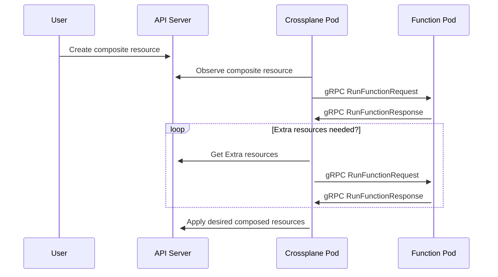

Compositions are a template for creating multiple managed resources as a single
object. 

A Composition _composes_ individual managed resources together into a larger,
reusable, solution.

An example Composition may combine a virtual machine, storage resources and
networking policies. A Composition template links all these individual
resources together. 

Here's an example Composition. When you create an
AcmeBucket composite resource
(XR) that uses this Composition, Crossplane uses the template to create the
Amazon S3 Bucket managed
resource.

```yaml {label="intro"}
apiVersion: apiextensions.crossplane.io/v1
kind: Composition
metadata:
  name: example
spec:
  compositeTypeRef:
    apiVersion: custom-api.example.org/v1alpha1
    kind: AcmeBucket
  mode: Pipeline
  pipeline:
  - step: patch-and-transform
    functionRef:
      name: function-patch-and-transform
    input:
      apiVersion: pt.fn.crossplane.io/v1beta1
      kind: Resources
      resources:
      - name: storage-bucket
        base:
          apiVersion: s3.aws.upbound.io/v1beta1
          kind: Bucket
          spec:
            forProvider:
              region: "us-east-2"
```



Crossplane has four core components that users commonly mix up:

* Compositions - This page. A template to define how to create resources.
* [Composite Resource Definition]()
  (`XRD`) - A custom API specification. 
* [Composite Resource]() (`XR`) - Created by
  using the custom API defined in a Composite Resource Definition. XRs use the
  Composition template to create new managed resources. 
* [Claims]() (`XRC`) - Like a Composite Resource, but
  with namespace scoping. 


## Create a Composition

Creating a Composition consists of:
* [Using composition functions](#use-a-function-in-a-composition) to define the
  resources to create.
* [Enabling composite resources](#enable-composite-resources) to use the
  Composition template.

A Composition is a pipeline of composition functions.

Composition functions (or just functions, for short) are Crossplane extensions
that template Crossplane resources. Crossplane calls the composition functions
to determine what resources it should create when you create a composite
resource (XR).


The Crossplane community has built lots of functions that let you template
Crossplane resources using
[CUE](https://github.com/crossplane-contrib/function-cue), Helm-like
[Go templates](https://github.com/crossplane-contrib/function-go-templating) or
legacy Crossplane
[Patch and Transforms]().

You can also [write your own function](#write-a-composition-function) using Go
or Python.



Crossplane has two modes of composition:

* `mode: Pipeline`
* `mode: Resources`

Use the `Pipeline` mode to use composition functions.

<!-- vale write-good.Passive = NO -->
The `Resources` mode is deprecated, and you shouldn't use it. Crossplane
supports Compositions that use the `Resources` mode for backward compatibility,
but the feature is no longer maintained. Crossplane doesn't accept new
`Resources` features, and only accepts security bug fixes.
<!-- vale write-good.Passive = YES -->

See the [CLI documentation]() to learn how to use the
`crossplane beta convert` command to convert a legacy `Resources` Composition to
the `Pipeline` mode. 



### Install a composition function

Installing a Function creates a function pod. Crossplane sends requests to this
pod to ask it what resources to create when you create a composite resource.

Install a Function with a Crossplane
Function object setting the
spec.package value to the
location of the function package.


For example, to install [Function Patch and Transform](),

```yaml {label="install"}
apiVersion: pkg.crossplane.io/v1
kind: Function
metadata:
  name: function-patch-and-transform
spec:
  package: xpkg.upbound.io/crossplane-contrib/function-patch-and-transform:v0.1.4
```


Functions are Crossplane Packages. Read more about Packages in the
[Packages documentation]().


By default, the Function pod installs in the same namespace as Crossplane
(`crossplane-system`).

### Verify a composition function

View the status of a Function with `kubectl get functions`

During the install a Function reports `INSTALLED` as `True` and `HEALTHY` as
`Unknown`.

```shell {copy-lines="1"}
kubectl get functions
NAME                              INSTALLED   HEALTHY   PACKAGE                                                                  AGE
function-patch-and-transform      True        Unknown   xpkg.upbound.io/crossplane-contrib/function-patch-and-transform:v0.1.4   10s
```

After the Function install completes and it's ready for use the `HEALTHY` status
reports `True`.

### Use a function in a composition

Crossplane calls a Function to determine what resources it should create when
you create a composite resource. The Function also tells Crossplane what to do
with these resources when you update or delete a composite resource.

When Crossplane calls a Function it sends it the current state of the composite
resource. It also sends it the current state of any managed resources the
composite resource owns.

Crossplane knows what Function to call when a composite resource changes by
looking at the Composition the composite resource uses.

To use composition functions set the Composition 
mode to
Pipeline.

Define a pipeline of 
steps. Each 
step calls a Function.  

Each step uses a 
functionRef to reference the
name of the Function to call. 


Compositions using mode: Pipeline 
can't specify resource templates with a `resources` field. 

Use function "Patch and Transform" to create resource templates.



Some Functions also allow you to specify an 
input.  
The function defines the
kind of input.

This example uses
[Function Patch and Transform]().
Function Patch and Transform implements Crossplane resource
templates.  
The input kind is Resources, 
and it accepts  resources as input.

```yaml {label="single",copy-lines="none"}
apiVersion: apiextensions.crossplane.io/v1
kind: Composition
# Removed for Brevity
spec:
  # Removed for Brevity
  mode: Pipeline
  pipeline:
  - step: patch-and-transform
    functionRef:
      name: function-patch-and-transform
    input:
      apiVersion: pt.fn.crossplane.io/v1beta1
      kind: Resources
      resources:
      - name: storage-bucket
        base:
          apiVersion: s3.aws.upbound.io/v1beta1
          kind: Bucket
          spec:
            forProvider:
              region: "us-east-2"
```

### Use a pipeline of functions in a composition

Crossplane can ask more than one Function what to do when a composite resource
changes. When a Composition has a pipeline of two or more steps, Crossplane
calls them all. It calls them in the order they appear in the pipeline.

Crossplane passes each Function in the pipeline the result of the previous
Function. This enables powerful combinations of Functions. In this example,
Crossplane calls function-cue to
create an S3 bucket. Crossplane then passes the bucket to 
function-auto-ready, which marks the
composite resource as ready when the bucket becomes ready.

```yaml {label="double",copy-lines="none"}
apiVersion: apiextensions.crossplane.io/v1
kind: Composition
# Removed for Brevity
spec:
  # Removed for Brevity
  mode: Pipeline
  pipeline:
  - step: cue-export-resources
    functionRef:
      name: function-cue
    input:
      apiVersion: cue.fn.crossplane.io/v1beta1
      kind: CUEInput
      name: storage-bucket
      export:
        target: Resources
        value: |
          apiVersion: "s3.aws.upbound.io/v1beta1"
          kind: "Bucket"
          spec: forProvider: region: "us-east-2"
  - step: automatically-detect-readiness
    functionRef:
      name: function-auto-ready
```


### Enable composite resources

A Composition is only a template defining how to create managed 
resources. A Composition limits which Composite Resources can use this
template. 

A Composition's compositeTypeRef 
defines which Composite Resource type can use this Composition. 


Read more about Composite Resources in the 
[Composite Resources page](). 


Inside a Composition's 
spec
define the Composite Resource 
apiVersion and 
kind
that the Composition allows to use this template.

```yaml {label="typeref",copy-lines="none"}
apiVersion: apiextensions.crossplane.io/v1
kind: Composition
metadata:
  name: dynamodb-with-bucket
spec:
  compositeTypeRef:
    apiVersion: custom-api.example.org/v1alpha1
    kind: database
  # Removed for brevity
```

### Store connection details

Some managed resources generate unique details like usernames, passwords, IP
addresses, ports or other connection details. 

When resources inside a Composition create connection details Crossplane creates
a Kubernetes secret object for each managed resource generating connection
details. 


This section discusses creating Kubernetes secrets.  
Crossplane also supports using external secret stores like
[HashiCorp Vault](https://www.vaultproject.io/). 

Read the [external secrets store guide]() for more information on using Crossplane
with an external secret store. 


#### Composite resource combined secret

Crossplane can combine all the secrets generated by the resources inside a
Composition into a single Kubernetes secret and optionally copy the secret
object for claims. 

Set the value of `writeConnectionSecretsToNamespace` to the namespace where
Crossplane should store the combined secret object.

```yaml {copy-lines="none",label="writeConn"}
apiVersion: apiextensions.crossplane.io/v1
kind: Composition
# Removed for Brevity
spec:
  writeConnectionSecretsToNamespace: my-namespace
  resources:
  # Removed for brevity
```

#### Composed resource secrets

Inside the `spec` of each resource producing connection details, define the
`writeConnectionSecretToRef`, with a `namespace` and `name` of the secret object
for the resource.  

If a `writeConnectionSecretToRef` isn't defined, Crossplane doesn't write any
keys to the secret.

```yaml {label="writeConnRes"}
apiVersion: apiextensions.crossplane.io/v1
kind: Composition
spec:
  writeConnectionSecretsToNamespace: other-namespace
  mode: Pipeline
  pipeline:
  - step: patch-and-transform
    functionRef:
      name: function-patch-and-transform
    input:
      apiVersion: pt.fn.crossplane.io/v1beta1
      kind: Resources
      resources:
      - name: key
        base:
          apiVersion: iam.aws.upbound.io/v1beta1
          kind: AccessKey
          spec:
            forProvider:
            # Removed for brevity
            writeConnectionSecretToRef:
              namespace: docs
              name: key1
```

Crossplane saves a secret with the `name` in the `namespace` provided.

```shell {label="viewComposedSec"}
kubectl get secrets -n docs
NAME   TYPE                                DATA   AGE
key1   connection.crossplane.io/v1alpha1   4      4m30s
```


Remember to create a unique name for each secret.


#### External secret stores

Crossplane 
[External Secret Stores]() 
write secrets and connection details to external secret stores like HashiCorp
Vault. 


External Secret Stores are an alpha feature.

They're not recommended for production use. Crossplane disables External Secret
Stores by default.


Use `publishConnectionDetailsWithStoreConfigRef` in place of
`writeConnectionSecretsToNamespace` to define the `StoreConfig` to save
connection details to. 

For example, using a `StoreConfig` with the `name` "vault," use
`publishConnectionDetailsWithStoreConfigRef.name` matching the
`StoreConfig.name`, in this example, "vault."


```yaml {label="gcp-storeconfig",copy-lines="none"}
apiVersion: gcp.crossplane.io/v1alpha1
kind: StoreConfig
metadata:
  name: vault
# Removed for brevity.
---
apiVersion: apiextensions.crossplane.io/v1
kind: Composition
# Removed for Brevity
spec:
  publishConnectionDetailsWithStoreConfigRef: 
    name: vault
  # Removed for brevity
```

For more details read the
[External Secret Stores]() 
integration guide.

## Test a composition

You can preview the output of any composition using the Crossplane CLI. You
don't need a Crossplane control plane to do this. The Crossplane CLI uses Docker
Engine to run functions.


The `crossplane render` command only supports composition functions. It doesn't
support `mode: Resources` Compositions.



See the [Crossplane CLI docs]() to
learn how to install and use the Crossplane CLI.



Running `crossplane render` requires [Docker](https://www.docker.com).


Provide a composite resource, composition and composition functions to render
the output locally. 

```shell
crossplane render xr.yaml composition.yaml functions.yaml
```

`crossplane render` prints resources as YAML to stdout. It prints the
composite resource first, followed by the resources the composition functions
created.

```yaml
---
apiVersion: example.crossplane.io/v1
kind: XBucket
metadata:
  name: example-render
---
apiVersion: s3.aws.upbound.io/v1beta1
kind: Bucket
metadata:
  annotations:
    crossplane.io/composition-resource-name: storage-bucket
  generateName: example-render-
  labels:
    crossplane.io/composite: example-render
  ownerReferences:
  - apiVersion: example.crossplane.io/v1
    blockOwnerDeletion: true
    controller: true
    kind: XBucket
    name: example-render
    uid: ""
spec:
  forProvider:
    region: us-east-2
```



You can recreate the output below by running `crossplane render` with
these files.

The `xr.yaml` file contains the composite resource to render:

```yaml
apiVersion: example.crossplane.io/v1
kind: XBucket
metadata:
  name: example-render
spec:
  bucketRegion: us-east-2
```

The `composition.yaml` file contains the Composition to use to render the
composite resource:

```yaml
apiVersion: apiextensions.crossplane.io/v1
kind: Composition
metadata:
  name: example-render
spec:
  compositeTypeRef:
    apiVersion: example.crossplane.io/v1
    kind: XBucket
  mode: Pipeline
  pipeline:
  - step: patch-and-transform
    functionRef:
      name: function-patch-and-transform
    input:
      apiVersion: pt.fn.crossplane.io/v1beta1
      kind: Resources
      resources:
      - name: storage-bucket
        base:
          apiVersion: s3.aws.upbound.io/v1beta1
          kind: Bucket
        patches:
        - type: FromCompositeFieldPath
          fromFieldPath: spec.bucketRegion
          toFieldPath: spec.forProvider.region
```

The `functions.yaml` file contains the Functions the Composition references in
its pipeline steps:

```yaml
---
apiVersion: pkg.crossplane.io/v1
kind: Function
metadata:
  name: function-patch-and-transform
spec:
  package: xpkg.upbound.io/crossplane-contrib/function-patch-and-transform:v0.1.4
```


The Crossplane CLI uses Docker Engine to run functions. You can change how the
Crossplane CLI runs a function by adding an annotation in `functions.yaml`. Add
the `render.crossplane.io/runtime` annotation to a Function to change how it's
run.

`crossplane render` supports two `render.crossplane.io/runtime` values:

* `Docker` (the default) connects to Docker Engine. It uses Docker to pull and
  run a function runtime.
* `Development` connects to a function runtime you have run manually.

When you use the Development
runtime the Crossplane CLI ignores the Function's package. Instead it expects you to make sure the function
is listening on localhost port 9443. The function must be listening without gRPC
transport security. Most function SDKs let you run a function with the
`--insecure` flag to disable transport security. For example you can run a Go
function locally using `go run . --insecure`.

```yaml {label="development"}
apiVersion: pkg.crossplane.io/v1
kind: Function
metadata:
  name: function-patch-and-transform
  annotations:
    render.crossplane.io/runtime: Development
spec:
  package: xpkg.upbound.io/crossplane-contrib/function-patch-and-transform:v0.1.4
```


Use the `Development` runtime when you
[write a composition function](#write-a-composition-function) to test your
function end-to-end.


`crossplane render` also supports the following Function annotations. These
annotations affect how it runs Functions:

* `render.crossplane.io/runtime-docker-cleanup` - When using the `Docker`
runtime this annotation specifies whether the CLI should stop the function
container after it calls the function. It supports the values `Stop`, to stop
the container, and `Orphan`, to leave it running.
* `render.crossplane.io/runtime-docker-pull-policy` - When using the `Docker`
  runtime this annotation specifies when the CLI should pull the Function's
  package. It supports the values `Always`, `Never`, and `IfNotPresent`.
* `render.crossplane.io/runtime-development-target` - When using the
  `Development` runtime this annotation tells the CLI to connect to a Function
  running at the specified target. It uses
  [gRPC target syntax](https://github.com/grpc/grpc/blob/v1.59.1/doc/naming.md).

## Verify a Composition

View all available Compositions with `kubectl get composition`.

```shell {copy-lines="1"}
kubectl get composition
NAME                                       XR-KIND        XR-APIVERSION                         AGE
xapps.aws.platformref.upbound.io           XApp           aws.platformref.upbound.io/v1alpha1   123m
xclusters.aws.platformref.upbound.io       XCluster       aws.platformref.upbound.io/v1alpha1   123m
xeks.aws.platformref.upbound.io            XEKS           aws.platformref.upbound.io/v1alpha1   123m
xnetworks.aws.platformref.upbound.io       XNetwork       aws.platformref.upbound.io/v1alpha1   123m
xservices.aws.platformref.upbound.io       XServices      aws.platformref.upbound.io/v1alpha1   123m
xsqlinstances.aws.platformref.upbound.io   XSQLInstance   aws.platformref.upbound.io/v1alpha1   123m
```

The `XR-KIND` lists the Composite Resource `kind` that's allowed to use the
Composition template.  
The `XR-APIVERSION` lists the Composite Resource API versions allowed to use the
Composition template. 


The output of `kubectl get composition` is different than `kubectl get
composite`. 

`kubectl get composition` lists all available Compositions.

`kubectl get composite` lists all created Composite Resources and their related
Composition. 


## Composition validation

When creating a Composition, Crossplane automatically validates its integrity,
checking that the Composition is well formed, for example:

If using `mode: Resources`:

* The `resources` field isn't empty.
* All resources either use a `name` or don't. Compositions can't use both named
  and unnamed resources.
* No duplicate resource names.
* Patch sets must have names.
* Patches that require a `fromFieldPath` value provide it.
* Patches that require a `toFieldPath` value provide it.
* Patches that require a `combine` field provide it.
* Readiness checks using `matchString` aren't empty.
* Readiness checks using `matchInteger` isn't `0`.
* Readiness checks requiring a `fieldPath` value provide it.

If using `mode: Pipeline` (Composition Functions):

* The `pipeline` field isn't empty.
* No duplicate step names.

### Composition schema aware validation

Crossplane also performs schema aware
validation of Compositions. Schema validation checks that `patches`, 
`readinessChecks` and `connectionDetails` are valid according to the resource 
schemas. For example, checking that the source and destination fields of a patch 
are valid according to the source and destination resource schema.


Composition schema aware validation is a beta feature. Crossplane enables
beta features by default. 

Disable schema aware validation by setting the
`--enable-composition-webhook-schema-validation=false` flag on the Crossplane
pod.  

The [Crossplane Pods]() page has
more information on enabling Crossplane flags.


#### Schema aware validation modes

Crossplane always rejects Compositions in case of integrity errors.

Set the schema aware validation mode to configure how Crossplane handles both
missing resource schemas and schema aware validation errors.


If a resource schema is missing, Crossplane skips schema aware validation
but still returns an error for integrity errors and a warning or an error
for the missing schemas.


The following modes are available:


| Mode     | Missing Schema | Schema Aware Error | Integrity Error |
| -------- | -------------- |--------------------|-----------------|
| `warn`   | Warning        | Warning            | Error           |
| `loose`  | Warning        | Error              | Error           |
| `strict` | Error          | Error              | Error           |


Change the validation mode for a Composition with the
crossplane.io/composition-schema-aware-validation-mode 
annotation.

If not specified, the default mode is `warn`.

For example, to enable `loose` mode checking set the annotation value to 
loose.

```yaml {copy-lines="none",label="mode"}
apiVersion: apiextensions.crossplane.io/v1
kind: Composition
metadata:
  annotations:
    crossplane.io/composition-schema-aware-validation-mode: loose
  # Removed for brevity
spec:
  # Removed for brevity
```


Validation modes also apply to Compositions defined by Configuration packages.

Depending on the mode configured in the Composition, schema aware validation
issues may result in warnings or the rejection of the Composition.

View the Crossplane logs for validation warnings.

Crossplane sets a Configuration as unhealthy if there are validation errors.
View the Configuration details with `kubectl describe configuration` to see the
specific errors.


## Write a composition function

Composition functions let you replace complicated Compositions with code written
in your programming language of choice. Crossplane has tools, software
development kits (SDKs) and templates to help you write a function.


<!-- vale write-good.Passive = NO -->
Here's an example of a tiny, hello world function. This example is written in
[Go](https://go.dev).
<!-- vale write-good.Passive = YES -->

```go
func (f *Function) RunFunction(_ context.Context, req *fnv1.RunFunctionRequest) (*fnv1.RunFunctionResponse, error) {
        rsp := response.To(req, response.DefaultTTL)
        response.Normal(rsp, "Hello world!")
        return rsp, nil
}
```

Crossplane has [language specific guides]() to writing a
composition function. Refer to the guide for your preferred language to learn
how to write a composition function.

When you're writing a composition function it's useful to know how composition
functions work. Read the next section to learn
[how composition functions work](#how-composition-functions-work).

## How composition functions work

Each composition function is actually a [gRPC](https://grpc.io) server. gRPC is
a high performance, open source remote procedure call (RPC) framework. When you
[install a function](#install-a-composition-function) Crossplane deploys the
function as a gRPC server. Crossplane encrypts and authenticates all gRPC
communication.

You don't have to be a gRPC expert to write a function. Crossplane's function
SDKs setup gRPC for you. It's useful to understand how Crossplane calls your
function though, and how your function should respond.



When you create, update, or delete a composite resource that uses composition
functions Crossplane calls each function in the order they appear in the
Composition's pipeline. Crossplane calls each function by sending it a gRPC
RunFunctionRequest. The function must respond with a gRPC RunFunctionResponse.


You can find detailed schemas for the RunFunctionRequest and RunFunctionResponse
RPCs in the [Buf Schema Registry](https://buf.build/crossplane/crossplane/docs/main:apiextensions.fn.proto.v1beta1).


When Crossplane calls a function the first time it includes four important
things in the RunFunctionRequest.

1. The __observed state__ of the composite resource, and any composed resources.
1. The __desired state__ of the composite resource, and any composed resources.
1. The function's __input__.
1. The function pipeline's __context__.

A function's main job is to update the __desired state__ and return it to
Crossplane. It does this by returning a RunFunctionResponse.

Most composition functions read the observed state of the composite resource,
and use it to add composed resources to the desired state. This tells Crossplane
which composed resources it should create or update.

If the function needs __extra resources__ to determine the desired state it can
request any cluster-scoped resource Crossplane already has access to, either by
by name or labels through the returned RunFunctionResponse. Crossplane then
calls the function again including the requested __extra resources__ and the
__context__ returned by the Function itself alongside the same __input__,
__observed__ and __desired state__ of the previous RunFunctionRequest. Functions
can iteratively request __extra resources__ if needed, but to avoid endlessly
looping Crossplane limits the number of iterations to 5. Crossplane considers
the function satisfied as soon as the __extra resources__ requests become
stable, so the Function returns the same exact request two times in a row.
Crossplane errors if stability isn't reached after 5 iterations.


<!-- vale write-good.Weasel = NO -->
<!-- Disable Weasel to say "usually", which is correct in this context. -->
A _composed_ resource is a resource created by a composite resource. Composed
resources are usually Crossplane managed resources (MRs), but they can be any
kind of Crossplane resource. For example a composite resource could also create
a ProviderConfig, or another kind of composite resource. 
<!-- vale write-good.Weasel = YES -->


### Observed state

When you create a composite resource like this one, Crossplane _observes_ it and
sends it to the composition function as part of the observed state.

```yaml
apiVersion: example.crossplane.io/v1
kind: XBucket
metadata:
  name: example-render
spec:
  bucketRegion: us-east-2
```

If any composed resources already exist, Crossplane observes them and sends them
to your function as part of the observed state.

Crossplane also observes the connection details of your composite resource and
any composed resources. It sends them to your function as part of the observed
state.

Crossplane observes the composite resource and any composed resources once,
right before it starts calling the functions in the pipeline. This means that
Crossplane sends every function in the pipeline the same observed state.

### Desired state

Desired state is the set of the changes the function pipeline wants to make to
the composite resource and any composed resources. When a function adds composed
resources to the desired state Crossplane creates them.

A function can change:

* The `status` of the composite resource.
* The `metadata` and `spec` of any composed resource.

A function can also change the connection details and readiness of the composite
resource. A function indicates that the composite resource is ready by telling
Crossplane whether its composed resources are ready. When the function pipeline
tells Crossplane that all composed resources are ready, Crossplane marks the
composite resource as ready.

A function can't change:

* The `metadata` or `spec` of the composite resource.
* The `status` of any composed resource.
* The connection details of any composed resource.

A pipeline of functions _accumulates_ desired state. This means that each
function builds upon the desired state of previous functions in the pipeline.
Crossplane sends a function the desired state accumulated by all previous
functions in the pipeline. The function adds to or updates the desired state and
then passes it on. When the last function in the pipeline has run, Crossplane
applies the desired state it returns.


A function __must__ copy all desired state from its RunFunctionRequest to its
RunFunctionResponse. If a function adds a resource to its desired state the next
function must copy it to its desired state. If it doesn't, Crossplane doesn't
apply the resource. If the resource exists, Crossplane deletes it.

A function can _intentionally_ choose not to copy parts of the desired state.
For example a function may choose not to copy a desired resource to prevent that
resource from existing.

Most function SDKs handle copying desired state automatically.


A function should only add the fields it cares about to the desired state. It
should add these fields every time Crossplane calls it. If a function adds a
field to the desired state once, but doesn't add it the next time it's called,
Crossplane deletes the field. The same is true for composed resources. If a
function adds a composed resource to the desired state, but doesn't add it the
next time it's called, Crossplane deletes the composed resource.


Crossplane uses
[server side apply](https://kubernetes.io/docs/reference/using-api/server-side-apply/)
to apply the desired state returned by a function pipeline. In server side apply
terminology, the desired state is a _fully specified intent_.


For example, if all a function wants is to make sure an S3 bucket in region
`us-east-2` exists, it should add this resource to its desired composed
resources.

```yaml
apiVersion: s3.aws.upbound.io/v1beta1
kind: Bucket
spec:
  forProvider:
    region: us-east-2
```

Even if the Bucket already exists and has other `spec` fields, or a `status`,
`name`, `labels`, etc the function should omit them. The function should only
include the fields it has an opinion about. Crossplane takes care of applying
the fields the function cares about, merging them with the existing Bucket.


Composition functions don't actually use YAML for desired and observed
resources. This example uses YAML for illustration purposes only.


### Function input

If a Composition includes input
Crossplane sends it to the function. Input is a useful way to provide extra
configuration to a function. Supporting input is optional. Not all functions
support input.

```yaml {label="input",copy-lines="none"}
apiVersion: apiextensions.crossplane.io/v1
kind: Composition
metadata:
  name: example-render
spec:
  compositeTypeRef:
    apiVersion: example.crossplane.io/v1
    kind: XBucket
  mode: Pipeline
  pipeline:
  - step: patch-and-transform
    functionRef:
      name: function-patch-and-transform
    input:
      apiVersion: pt.fn.crossplane.io/v1beta1
      kind: Resources
      resources:
      - name: storage-bucket
        base:
          apiVersion: s3.aws.upbound.io/v1beta1
          kind: Bucket
        patches:
        - type: FromCompositeFieldPath
          fromFieldPath: spec.bucketRegion
          toFieldPath: spec.forProvider.region
```


Crossplane doesn't validate function input. It's a good idea for a function to
validate its own input.


### Function pipeline context

Sometimes two functions in a pipeline want to share information with each other
that isn't desired state. Functions can use context for this. Any function can
write to the pipeline context. Crossplane passes the context to all following
functions. When Crossplane has called all functions it discards the pipeline
context.

Crossplane can write context too. If you enable the alpha
[composition environment]() feature Crossplane
writes the environment to the top-level context field
`apiextensions.crossplane.io/environment`.