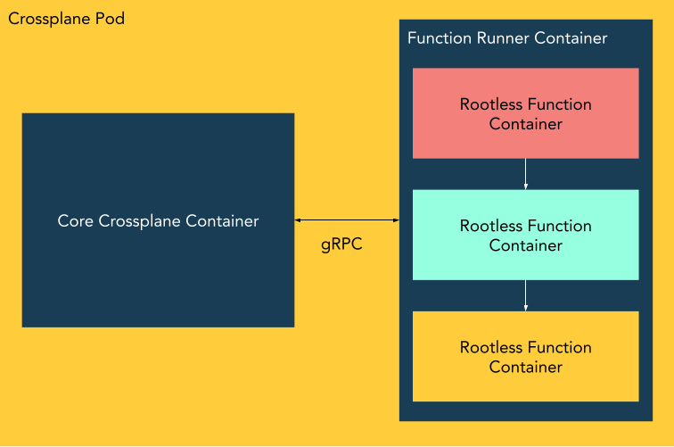

Composition Functions allow you to supplement or replace your Compositions with
advanced logic, using either programming languages such as Go or Python, or
relevant tools such as Helm, kustomize, or CUE. They compliment contemporary
"Patch and Transform" (P&T) style Composition - it's possible to use only P&T,
only Functions, or a mix of both in the same Composition.

```yaml
apiVersion: apiextensions.crossplane.io/v2alpha1
kind: Composition
metadata:
  name: example
spec:
  compositeTypeRef:
    apiVersion: database.example.org/v1alpha1
    kind: XPostgreSQLInstance
  functions:
  - name: my-cool-function
    type: Container
    container:
      image: xpkg.upbound.io/my-cool-function:0.1.0
```

A Composition Function is a short-lived OCI container that tells Crossplane how
to reconcile a Composite Resource (XR). The preceding example shows a minimal
`Composition` that uses a Composition Function rather than the typical P&T style
array of `resources`.

## Enabling Composition Functions

To enable support for Composition Functions you must:

 * Enable the alpha feature flag.
 * Deploy a runner that is responsible for running functions.

```console
# TODO(negz): Update this to use crossplane-stable, not an RC build, once v1.11 has been released.

kubectl create namespace crossplane-system

helm repo add crossplane-master https://charts.crossplane.io/master/
helm repo update

# Find the latest RC build of Crossplane - e.g. 1.11.0-rc.0.274.g51a07e50
helm search repo crossplane-master/crossplane --devel

RC_VERSION="v1.11.0-rc.0.274.g51a07e50"
helm install crossplane --namespace crossplane-system crossplane-master/crossplane \
    --devel --version ${RC_VERSION} \
    --set "args={--debug,--enable-composition-functions}" \
    --set "xfn.enabled=true" \
    --set "xfn.args={--debug}"
```

The preceding Helm command installs Crossplane with the Composition Functions
feature flag enabled, and with the reference "`xfn`" Composition Function runner
deployed as a sidecar pod. You can confirm Composition Functions are enabled by
looking for a log line like:

```json
{"level":"info","ts":1674535093.36186,"logger":"crossplane","msg":"Alpha feature enabled","flag":"EnableAlphaCompositionFunctions"}
```

## The xfn Runner

Composition Function runners are designed to be pluggable. Each time Crossplane
needs to invoke a Composition Function it makes a gRPC call to a configurable
endpoint. The default, reference Composition Function runner is named `xfn`.



`xfn` is deployed as a sidecar container within the Crossplane pod. It runs each
Composition Function as a nested [Rootless Container][rootless-containers]. The
Crossplane Helm chart deploys `xfn` with slightly elevated permissions. Namely:

* The [Unconfined seccomp profile][kubernetes-seccomp].
* `CAP_SETUID` and `CAP_SETGID`.

`xfn` doesn't strictly need either of these. It's possible to run it under
seccomp but doing so is onerous. You must author a custom profile that allows a
few additional syscalls required to run containers, including `unshare`,
`mount`, and `unmount`. Refer to the [seccomp documentation][kubernetes-seccomp]
for information on how to do so.

Granting `CAP_SETUID` and `CAP_SETGID` is optional. Doing so allows `xfn` to
create slightly better rootless containers. If `xfn` is not granted these
capabilities it will not support multiple users and groups inside Composition
Function containers; only UID and GID 0 will exist. Regardless of capabilities
`xfn` always runs each Composition Function as an unprivileged user. That user
will appear to be root inside the Composition Function container thanks to 
[`user_namespaces(7)`].

## Using Composition Functions

```
TODO(negz):

* Some ideas/inspiration.
* Examples
    * A less simple Composition that uses functions and P&T.
```

## Building a Composition Function

 Crossplane is mostly unopinionated about how a Composition Function is built.
 Functions must:

 * Be packaged as an OCI image, where the `ENTRYPOINT` is the function.
 * Accept input in the form of a `FunctionIO` document on stdin.
 * Return the `FunctionIO` they were passed, optionally mutated, on stdout.
 * Run within the constraints specified by the Composition that includes them
   (e.g. timeouts, compute, network access).

```
TODO(negz):

* FunctionIO example - link to Go type def for 'full spec' (for now).
* Example function w/Dockerfile - something single file (quote annotator?)
* Things to keep in mind
    * Handling Observed and desired state.
    * You need to name your resources (we only add owner ref, annotations).
    * How to handle errors.
```

[rootless-containers]: https://rootlesscontaine.rs
[kubernetes-seccomp]: https://kubernetes.io/docs/tutorials/security/seccomp/
[`user_namespaces(7)`]: https://man7.org/linux/man-pages/man7/user_namespaces.7.html