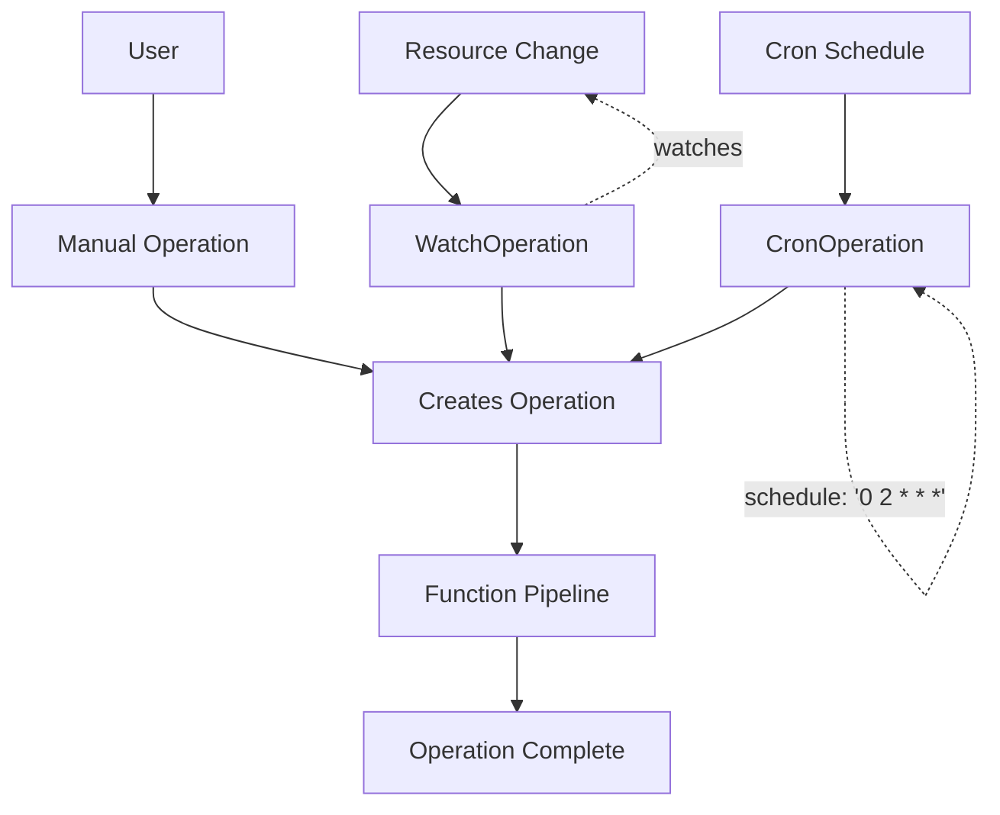
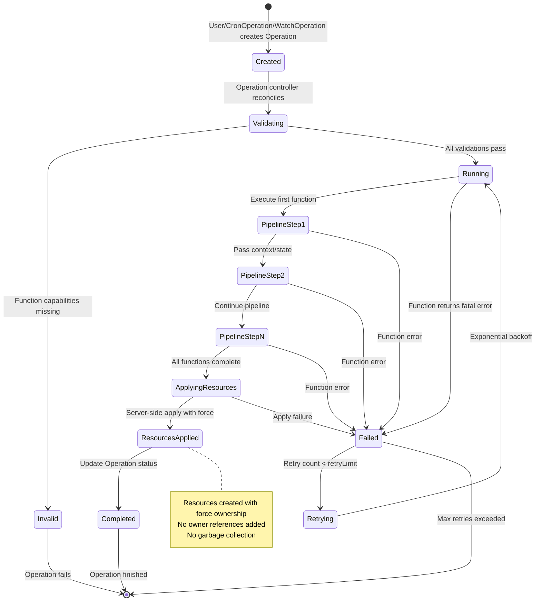
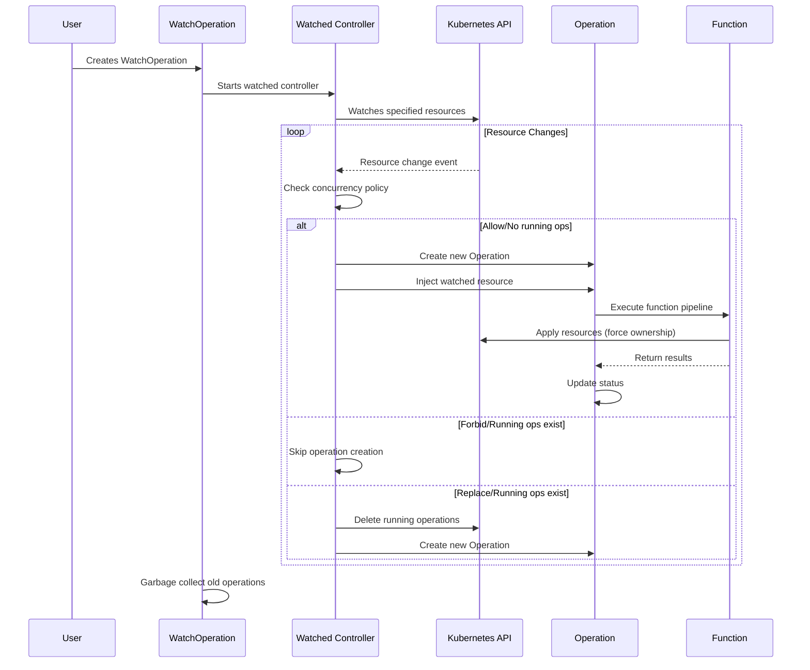

# Crossplane Operations: End-User Guide

## Overview

Crossplane Operations enable you to build day-two operational workflows using
operation functions. Instead of just creating and managing resources, you can
now automate operational tasks like rolling upgrades, database backups,
configuration validation, and resource cleanup.

Operations work similarly to Crossplane composite resources (XRs) but run once
to completion (like Kubernetes Jobs) rather than continuously reconciling
desired state. Like XRs use composition functions, Operations use operation
functions to execute their workflows. You can trigger operations manually, on a
schedule, or when resources change.



## Enabling Operations

Operations are currently an alpha feature and must be explicitly enabled in your
Crossplane installation.

### Enable via Helm Installation

When installing Crossplane with Helm, add the `--enable-operations` flag to
the args:

```bash
helm upgrade --install crossplane crossplane-stable/crossplane \
  --namespace crossplane-system \
  --create-namespace \
  --set args='{"--enable-operations"}'
```

## Getting Started

Let's create your first Operation to see how it works:

1. **Install the function-dummy function** (v0.4.1 or above supports operations):

```yaml
apiVersion: pkg.crossplane.io/v1
kind: Function
metadata:
  name: function-dummy
spec:
  package: xpkg.crossplane.io/crossplane-contrib/function-dummy:v0.4.1
```

```bash
kubectl apply -f function-dummy.yaml
# Wait for it to be ready
kubectl get function function-dummy -w
```

2. **Create a simple Operation** that runs a function:

```yaml
apiVersion: ops.crossplane.io/v1alpha1
kind: Operation
metadata:
  name: my-first-operation
spec:
  mode: Pipeline
  pipeline:
  - step: create-configmap
    functionRef:
      name: function-dummy
    input:
      apiVersion: dummy.fn.crossplane.io/v1beta1
      kind: Response
      # This is a YAML-serialized RunFunctionResponse. function-dummy will
      # overlay the desired state on any that was passed into it.
      response:
        desired:
          resources:
            configmap:
              resource:
                apiVersion: v1
                kind: ConfigMap
                metadata:
                  namespace: default
                  name: hello-from-operations
                data:
                  message: "Hello from Operations!"
        results:
         - severity: SEVERITY_NORMAL
           message: "I am doing an operate!"
```

3. **Monitor the operation** with kubectl:

```bash
# Watch the operation status
kubectl get operation my-first-operation -w

# Check detailed status
kubectl describe operation my-first-operation

# View events
kubectl get events --field-selector involvedObject.name=my-first-operation

# Check if the ConfigMap was created
kubectl get configmap hello-from-operations -o yaml
```

4. **Try a scheduled operation** with CronOperation:

```yaml
apiVersion: ops.crossplane.io/v1alpha1
kind: CronOperation
metadata:
  name: daily-hello
spec:
  schedule: "0 9 * * *"  # Daily at 9 AM
  operationTemplate:
    spec:
      mode: Pipeline
      pipeline:
      - step: hello
        functionRef:
          name: function-dummy
        input:
          apiVersion: dummy.fn.crossplane.io/v1beta1
          kind: Response
          response:
            results:
             - severity: SEVERITY_NORMAL
               message: "Good morning from CronOperation!"
```

## Core Concepts

### Operation
An `Operation` runs a function pipeline once to completion. It's the fundamental
building block for operational workflows.

```yaml
apiVersion: ops.crossplane.io/v1alpha1
kind: Operation
metadata:
  name: backup-database
spec:
  mode: Pipeline
  pipeline:
  - step: create-backup
    functionRef:
      name: function-database-backup
    input:
      apiVersion: fn.crossplane.io/v1beta1
      kind: DatabaseBackupInput
      database: my-production-db
      retentionDays: 30
```

**Key Features:**
- Runs once to completion with success/failure status
- Can mutate any Kubernetes resources using server-side apply
- Supports multi-step pipelines with function composition
- Provides detailed status and results from each pipeline step

### CronOperation
A `CronOperation` creates `Operation` resources on a schedule, like Kubernetes
CronJobs.

```yaml
apiVersion: ops.crossplane.io/v1alpha1
kind: CronOperation
metadata:
  name: daily-backup
spec:
  schedule: "0 2 * * *"  # Daily at 2 AM
  concurrencyPolicy: Forbid
  successfulHistoryLimit: 5
  failedHistoryLimit: 3
  operationTemplate:
    spec:
      mode: Pipeline
      pipeline:
      - step: backup
        functionRef:
          name: function-database-backup
        input:
          apiVersion: fn.crossplane.io/v1beta1
          kind: DatabaseBackupInput
          retentionDays: 7
```

**Key Features:**
- Standard cron scheduling syntax
- Configurable concurrency policies (Allow, Forbid, Replace)
- Automatic garbage collection of old Operations
- Tracks last successful execution and running operations

### WatchOperation
A `WatchOperation` creates `Operation` resources when watched Kubernetes
resources change.

```yaml
apiVersion: ops.crossplane.io/v1alpha1
kind: WatchOperation
metadata:
  name: app-deployment-monitor
spec:
  watch:
    apiVersion: apps/v1
    kind: Deployment
    namespace: production
    matchLabels:
      app: my-app
  concurrencyPolicy: Allow
  operationTemplate:
    spec:
      mode: Pipeline
      pipeline:
      - step: validate-deployment
        functionRef:
          name: function-deployment-validator
        input:
          apiVersion: fn.crossplane.io/v1beta1
          kind: DeploymentValidatorInput
```

**Key Features:**
- Watches any Kubernetes resource type
- Supports namespace and label filtering
- Automatically injects the changed resource into the operation
- Tracks count of watched resources and operation history

## Operation Lifecycle

Understanding how Operations work internally helps you debug and monitor them
effectively:



## Common Use Cases

### 1. Scheduled Database Backups
```yaml
apiVersion: ops.crossplane.io/v1alpha1
kind: CronOperation
metadata:
  name: postgres-backup
spec:
  schedule: "0 3 * * *"  # Daily at 3 AM
  operationTemplate:
    spec:
      mode: Pipeline
      pipeline:
      - step: backup
        functionRef:
          name: function-postgres-backup
        input:
          apiVersion: fn.crossplane.io/v1beta1
          kind: PostgresBackupInput
          instance: production-db
          s3Bucket: db-backups
```

### 2. Rolling Cluster Upgrades
```yaml
apiVersion: ops.crossplane.io/v1alpha1
kind: Operation
metadata:
  name: cluster-upgrade
spec:
  mode: Pipeline
  pipeline:
  - step: upgrade
    functionRef:
      name: function-cluster-upgrade
    input:
      apiVersion: fn.crossplane.io/v1beta1
      kind: ClusterUpgradeInput
      targetVersion: "1.28"
      batches: [0.25, 0.5, 1.0]  # Upgrade 25%, then 50%, then 100%
      healthChecks:
      - Synced
      - Ready
```

### 3. Resource Change Reactions
```yaml
apiVersion: ops.crossplane.io/v1alpha1
kind: WatchOperation
metadata:
  name: config-validator
spec:
  watch:
    apiVersion: v1
    kind: ConfigMap
    matchLabels:
      validate: "true"
  operationTemplate:
    spec:
      mode: Pipeline
      pipeline:
      - step: validate
        functionRef:
          name: function-config-validator
        input:
          apiVersion: fn.crossplane.io/v1beta1
          kind: ConfigValidatorInput
      - step: notify
        functionRef:
          name: function-slack-notifier
        input:
          apiVersion: fn.crossplane.io/v1beta1
          kind: SlackNotifierInput
```

## Working with Required Resources

Operations can declare required resources that functions need access to. This is
especially useful for WatchOperations where you want to process the changed
resource.

```yaml
apiVersion: ops.crossplane.io/v1alpha1
kind: Operation
metadata:
  name: process-config
spec:
  mode: Pipeline
  pipeline:
  - step: process
    functionRef:
      name: function-config-processor
    input:
      apiVersion: fn.crossplane.io/v1beta1
      kind: ConfigProcessorInput
    requirements:
      requiredResources:
      - requirementName: source-config
        apiVersion: v1
        kind: ConfigMap
        name: app-config
        namespace: default
```

For WatchOperations, the watched resource is automatically injected with the
special requirement name `ops.crossplane.io/watched-resource`.

## Configuration Options

### Concurrency Policies
- **Allow**: Multiple operations can run simultaneously (default)
- **Forbid**: New operations won't start if others are running
- **Replace**: New operations terminate running ones

### History Limits
- `successfulHistoryLimit`: Number of successful operations to keep (default: 3)
- `failedHistoryLimit`: Number of failed operations to keep (default: 1)

### Pause Operations
Pause any operation type using the standard Crossplane annotation:
```yaml
metadata:
  annotations:
    crossplane.io/paused: "true"
```

## Status and Monitoring

All operation types provide rich status information:

```yaml
status:
  conditions:
  - type: Synced
    status: "True"
    reason: ReconcileSuccess
  - type: Scheduling  # CronOperation only
    status: "True"
    reason: ScheduleActive
  - type: Watching    # WatchOperation only
    status: "True"
    reason: WatchActive
  watchingResources: 12  # WatchOperation only
  lastScheduleTime: "2024-01-15T10:00:00Z"
  lastSuccessfulTime: "2024-01-15T10:02:30Z"
  runningOperationRefs:
  - name: daily-backup-1705305600
```

### Events

Each operation type emits Kubernetes events for important lifecycle activities:

**Operation Events:**
- `RunPipelineStep` (Normal/Warning) - Function execution results and warnings
- `FunctionInvocation` (Warning) - Function invocation failures
- `InvalidOutput` (Warning) - Function output marshaling errors
- `InvalidResource` (Warning) - Resource application failures
- `InvalidPipeline` (Warning) - Function capability check failures
- `BootstrapRequirements` (Warning) - Required resource fetch failures
- `MaxFailures` (Warning) - Operation exceeded retry limit

**CronOperation Events:**
- `CreateOperation` (Warning) - Scheduled operation creation failures
- `GarbageCollectOperations` (Warning) - Garbage collection failures
- `ReplaceRunningOperation` (Warning) - Running operation deletion failures
  during replace policy
- `InvalidSchedule` (Warning) - Cron schedule parsing errors
- `ListOperations` (Warning) - Operation listing failures

**WatchOperation Events:**
- `EstablishWatched` (Warning) - Watch establishment failures
- `TerminateWatched` (Warning) - Watch termination failures
- `GarbageCollectOperations` (Warning) - Operation cleanup failures
- `CreateOperation` (Warning) - Operation creation failures (from watched
  controller)
- `ReplaceRunningOperation` (Warning) - Running operation deletion failures
  during replace policy (from watched controller)
- `ListOperations` (Warning) - Operation listing failures (from watched
  controller)

### Prometheus Metrics

Operations expose comprehensive Prometheus metrics for monitoring function
execution, controller management, and caching performance.

#### Function Execution Metrics

**Operations use these metrics when executing operation functions:**

> **Note:** These metrics are named `crossplane_composition_*` for historical
> reasons but apply to both composition functions and operation functions. They
> may be renamed to `crossplane_functions_*` in a future release.

- `crossplane_composition_run_function_request_total` - Counter of function
  requests sent
  - Labels: `function_name`, `function_package`, `grpc_target`, `grpc_method`
  
- `crossplane_composition_run_function_response_total` - Counter of function
  responses received
  - Labels: `function_name`, `function_package`, `grpc_target`, `grpc_method`,
    `grpc_code`, `result_severity`
  
- `crossplane_composition_run_function_seconds` - Histogram of function
  execution latency
  - Labels: `function_name`, `function_package`, `grpc_target`, `grpc_method`,
    `grpc_code`, `result_severity`

#### Controller Engine Metrics

**WatchOperations use these metrics when managing dynamic controllers:**

- `crossplane_engine_controllers_started_total` - Counter of controllers started
  - Labels: `controller` (follows pattern `watched/{watch-operation-name}`)
  
- `crossplane_engine_controllers_stopped_total` - Counter of controllers stopped
  - Labels: `controller`
  
- `crossplane_engine_watches_started_total` - Counter of watches started
  - Labels: `controller`, `type` (will be `WatchOperation` for WatchOperations)
  
- `crossplane_engine_watches_stopped_total` - Counter of watches stopped
  - Labels: `controller`, `type`

#### Function Response Cache Metrics

**Operations use these metrics when function response caching is enabled:**

- `crossplane_composition_run_function_response_cache_hits_total` - Counter of cache hits
  - Labels: `function_name`
  
- `crossplane_composition_run_function_response_cache_misses_total` - Counter of cache misses
  - Labels: `function_name`
  
- `crossplane_composition_run_function_response_cache_errors_total` - Counter of cache errors
  - Labels: `function_name`
  
- `crossplane_composition_run_function_response_cache_writes_total` - Counter of cache writes
  - Labels: `function_name`
  
- `crossplane_composition_run_function_response_cache_deletes_total` - Counter of cache deletes
  - Labels: `function_name`
  
- `crossplane_composition_run_function_response_cache_bytes_written_total` - Counter of bytes written to cache
  - Labels: `function_name`
  
- `crossplane_composition_run_function_response_cache_bytes_deleted_total` - Counter of bytes deleted from cache
  - Labels: `function_name`
  
- `crossplane_composition_run_function_response_cache_read_seconds` - Histogram of cache read latency
  - Labels: `function_name`
  
- `crossplane_composition_run_function_response_cache_write_seconds` - Histogram of cache write latency
  - Labels: `function_name`

#### Monitoring Recommendations

**For Operations:**
- Monitor function execution latency using the `_seconds` histogram
- Track function failure rates using `result_severity` labels (Fatal, Warning, Normal)
- Monitor cache hit ratios when caching is enabled

**For WatchOperations:**
- Monitor controller lifecycle using engine controller metrics
- Track watch establishment/termination using engine watch metrics
- Alert on controller or watch failures

**For CronOperations:**
- Monitor scheduled execution patterns through standard Operation metrics
- Track garbage collection effectiveness through controller logs and events

#### Higher-Level Metrics with Recording Rules

You can create higher-level operational metrics using Prometheus recording rules. These precomputed metrics provide better performance for dashboards and alerting:

**Function Success Rate:**
```yaml
groups:
- name: crossplane-operations
  rules:
  - record: crossplane:operation_function_success_rate5m
    expr: |
      sum(rate(crossplane_composition_run_function_response_total{result_severity="Normal"}[5m])) by (function_name)
      /
      sum(rate(crossplane_composition_run_function_response_total[5m])) by (function_name)
```

**Function Average Latency:**
```yaml
  - record: crossplane:operation_function_latency_avg5m
    expr: |
      sum(rate(crossplane_composition_run_function_seconds_sum[5m])) by (function_name)
      /
      sum(rate(crossplane_composition_run_function_seconds_count[5m])) by (function_name)
```

**Operation Throughput by Type:**
```yaml
  - record: crossplane:operation_throughput_by_type5m
    expr: |
      sum(rate(crossplane_composition_run_function_request_total[5m])) by (function_name)
```

**WatchOperation Controller Health:**
```yaml
  - record: crossplane:watchoperation_controller_health
    expr: |
      sum(rate(crossplane_engine_controllers_started_total[5m])) by (controller)
      -
      sum(rate(crossplane_engine_controllers_stopped_total[5m])) by (controller)
```

**Function Cache Hit Rate:**
```yaml
  - record: crossplane:function_cache_hit_rate5m
    expr: |
      sum(rate(crossplane_composition_run_function_response_cache_hits_total[5m])) by (function_name)
      /
      (
        sum(rate(crossplane_composition_run_function_response_cache_hits_total[5m])) by (function_name)
        +
        sum(rate(crossplane_composition_run_function_response_cache_misses_total[5m])) by (function_name)
      )
```

**Operation Error Rate by Severity:**
```yaml
  - record: crossplane:operation_error_rate_by_severity5m
    expr: |
      sum(rate(crossplane_composition_run_function_response_total{result_severity!="Normal"}[5m])) by (function_name, result_severity)
      /
      sum(rate(crossplane_composition_run_function_response_total[5m])) by (function_name)
```

**WatchOperation Activity Level:**
```yaml
  - record: crossplane:watchoperation_activity_level5m
    expr: |
      sum(rate(crossplane_engine_watches_started_total{type="WatchOperation"}[5m])) by (controller)
```

These recording rules enable you to:
- Create dashboards showing operation success rates and latencies
- Set up alerting on function failure rates or cache miss rates
- Monitor WatchOperation controller stability
- Track operational throughput and performance trends
- Identify problematic functions or operations quickly

### WatchOperation Workflow



## Best Practices

1. **Use descriptive names** for operations that include their purpose
2. **Set appropriate history limits** to balance debugging and resource usage
3. **Choose concurrency policies carefully** based on your operational needs
4. **Monitor operation status** through standard Kubernetes tooling
5. **Test operations thoroughly** before deploying to production
6. **Use required resources** to make function dependencies explicit
7. **Implement proper error handling** in your operation functions

## Package Distribution

Operations can be packaged and distributed using Crossplane Configurations:

```yaml
apiVersion: meta.pkg.crossplane.io/v1
kind: Configuration
metadata:
  name: database-operations
spec:
  dependsOn:
  - provider: xpkg.upbound.io/crossplane-contrib/provider-sql
    version: ">=v0.5.0"
```

This allows you to version and distribute operational workflows alongside your
platform configurations.

## Function Development

Operations use operation functions that are built like composition functions but
designed for operational workflows. Operation functions use the same function
SDK as composition functions. Key differences:
- Functions receive required resources instead of observed composite resources
- Functions can return output in the response for status tracking
- Functions should focus on operational logic rather than resource composition

### Function Capabilities

Crossplane validates that functions have the appropriate capabilities for their
intended use. Functions must explicitly declare the `operation` capability to
be used in Operations. Functions must declare the `composition` capability to
be used in Compositions. Functions without any declared capabilities default to
having the `composition` capability for backward compatibility.

**Example operation function package metadata (crossplane.yaml):**
```yaml
apiVersion: meta.pkg.crossplane.io/v1
kind: Function
metadata:
  name: function-database-backup
spec:
  capabilities:
  - operation
  crossplane:
    version: ">=v1.18.0"
```

**Example FunctionRevision status showing capabilities:**
```yaml
apiVersion: pkg.crossplane.io/v1
kind: FunctionRevision
metadata:
  name: function-database-backup-abc123
status:
  capabilities:
  - operation
  # ... other status fields
```

**Important:** You must use a Crossplane CLI (crank) build with capability
support when building function packages. Older versions of the CLI will
silently drop the capabilities field during package build time, causing
capability validation to fail at runtime.

### How Operation Functions Work

Operation functions use the same gRPC interface as composition functions,
including the same `RunFunctionRequest` and `RunFunctionResponse` messages.
However, there are important differences in how Operations use these messages:

**Key Differences from Composition Functions:**

1. **No Observed Resources**: Crossplane never sends observed resources to
   operation functions. The `observed.resources` field in `RunFunctionRequest`
   will be empty.

2. **Required Resources Only**: Operation functions only receive resources they
   explicitly request via `requirements.resources` in `RunFunctionResponse`, or
   that are specified in the pipeline step's `requirements` field.

3. **Resource Creation**: Functions can create or update arbitrary Kubernetes
   resources by returning them in `desired.resources` in `RunFunctionResponse`.

4. **No Owner References**: Crossplane doesn't establish ownership
   relationships between Operations and the resources they create - no owner
   references are added automatically.

5. **No Garbage Collection**: Operation functions cannot delete resources,
   including resources they previously created. Resources created by operations
   are not garbage collected when the operation completes. This is a known
   limitation of the alpha implementation.

6. **Function Output**: Unlike composition functions, operation functions can
   return output in `RunFunctionResponse.output` which is stored in the
   Operation's status for tracking and debugging.

7. **Force Ownership**: Operations use server-side apply with force ownership
   when applying resources, which means they can take ownership of fields from
   other controllers.

**Important Considerations:**

- **Take care with WatchOperations**: Since operations force ownership when
  applying resources, ensure that WatchOperations don't conflict with other
  controllers managing the same resources.

- **Connection Details and Conditions**: Fields like `connection_details` and
  `conditions` are ignored by Operations as they're composition-specific.

- **Ready State**: The `ready` field is also ignored by Operations since they
  run to completion rather than maintaining desired state.

### Function Pipeline Comparison

```mermaid
flowchart TD
    subgraph "Composition Functions"
        A1[Composite Resource] --> B1[Function Pipeline]
        C1[Observed Resources] --> B1
        B1 --> D1[Desired Resources]
        D1 --> E1[Crossplane Controller]
        E1 --> F1[Creates/Updates Resources]
        F1 --> G1[Owner References Added]
        G1 --> H1[Garbage Collection]
    end
    
    subgraph "Operation Functions"
        A2[Operation] --> B2[Function Pipeline]
        C2[Required Resources Only] --> B2
        B2 --> D2[Arbitrary Resources]
        D2 --> E2[Operation Controller]
        E2 --> F2[Force Apply Resources]
        F2 --> G2[No Owner References]
        G2 --> H2[No Garbage Collection]
    end
```



## API Reference

### Operation

The `Operation` type defines a pipeline of functions that runs once to
completion.

#### spec

| Field | Type | Description |
|-------|------|-------------|
| `mode` | `string` | Operation mode. Currently only `"Pipeline"` is supported. This field determines how the operation executes. |
| `pipeline` | `array` | List of function steps to execute (1-99 steps). Each step runs sequentially and can pass data to the next step. |
| `retryLimit` | `integer` | Maximum number of retry attempts when the operation fails (default: 5). Use this to control how many times a failed operation should be retried before giving up. The Operation controller retries with exponential backoff starting at 1 second and capped at 30 seconds (1s, 2s, 4s, 8s, 16s, 30s, 30s, ...). |

#### spec.pipeline[*]

| Field | Type | Description |
|-------|------|-------------|
| `step` | `string` | Unique name for this step within the pipeline. Used for referencing in status and debugging. |
| `functionRef` | `object` | Reference to the function to execute. Must be the name of an installed Function resource. |
| `input` | `object` | Optional input data passed to the function. Must be a KRM resource with apiVersion and kind (usually fn.crossplane.io/v1beta1), but no metadata by convention. |
| `credentials` | `array` | Optional credentials the function needs to access external systems. |
| `requirements` | `object` | Resources that must be available before this step runs. Useful for ensuring dependencies are met. |

#### spec.pipeline[*].credentials[*]

| Field | Type | Description |
|-------|------|-------------|
| `name` | `string` | Name of the credentials for reference within the function. |
| `source` | `string` | Source type: `"None"` or `"Secret"`. Use `"Secret"` to provide credentials from a Kubernetes Secret. |
| `secretRef` | `object` | Reference to a Secret containing credentials when source is `"Secret"`. |

#### spec.pipeline[*].requirements

| Field | Type | Description |
|-------|------|-------------|
| `requiredResources` | `array` | List of resources that must be fetched before the function runs. This pre-populates the function with necessary resources. |

#### spec.pipeline[*].requirements.requiredResources[*]

| Field | Type | Description |
|-------|------|-------------|
| `requirementName` | `string` | Unique name for this resource requirement. Used as the key in the function's resource map. |
| `apiVersion` | `string` | API version of the resource to fetch (e.g., `"v1"`, `"apps/v1"`). |
| `kind` | `string` | Kind of resource to fetch (e.g., `"ConfigMap"`, `"Deployment"`). |
| `name` | `string` | Name of a specific resource to fetch. Either `name` or `matchLabels` must be specified. |
| `matchLabels` | `object` | Label selector to match multiple resources. Either `name` or `matchLabels` must be specified. |
| `namespace` | `string` | Namespace to search in (optional for cluster-scoped resources). |

#### status

| Field | Type | Description |
|-------|------|-------------|
| `conditions` | `array` | Standard Crossplane conditions indicating the operation's state. |
| `failures` | `integer` | Number of times this operation has failed and been retried. |
| `pipeline` | `array` | Output from each pipeline step that has executed. |
| `appliedResourceRefs` | `array` | References to all resources the operation created or modified. |

#### status.pipeline[*]

| Field | Type | Description |
|-------|------|-------------|
| `step` | `string` | Name of the pipeline step. |
| `output` | `object` | Output returned by the function for this step. |

#### status.appliedResourceRefs[*]

| Field | Type | Description |
|-------|------|-------------|
| `apiVersion` | `string` | API version of the applied resource. |
| `kind` | `string` | Kind of the applied resource. |
| `namespace` | `string` | Namespace of the applied resource (if namespaced). |
| `name` | `string` | Name of the applied resource. |

#### Operation Status Conditions

| Type | Status | Reason | Description |
|------|--------|--------|-------------|
| `Succeeded` | `Unknown` | `PipelineRunning` | The operation is currently executing. |
| `Succeeded` | `True` | `PipelineSuccess` | The operation completed successfully. |
| `Succeeded` | `False` | `PipelineError` | The operation failed and will not be retried. |
| `ValidPipeline` | `True` | `ValidPipeline` | The operation's function pipeline is valid. |
| `ValidPipeline` | `False` | `MissingCapabilities` | Required function capabilities are missing. |
| `Synced` | `True` | `ReconcileSuccess` | The operation controller is functioning normally. |
| `Synced` | `False` | `ReconcileError` | The operation controller encountered an error during reconciliation. |
| `Synced` | `False` | `ReconcilePaused` | The operation is paused via annotation. |

#### Operation Annotations

| Annotation | Description |
|------------|-------------|
| `crossplane.io/paused` | Set to `"true"` to pause the operation. Paused operations will not execute but remain in the cluster. |

---

### CronOperation

The `CronOperation` type creates `Operation` resources on a cron schedule.

#### spec

| Field | Type | Description |
|-------|------|-------------|
| `schedule` | `string` | Cron schedule expression (e.g., `"0 2 * * *"` for daily at 2 AM). Uses standard cron syntax. |
| `startingDeadlineSeconds` | `integer` | Maximum seconds after scheduled time to start the operation. If exceeded, the operation is skipped. |
| `concurrencyPolicy` | `string` | How to handle concurrent operations: `"Allow"` (default), `"Forbid"`, or `"Replace"`. |
| `successfulHistoryLimit` | `integer` | Number of successful operations to retain for history (default: 3). |
| `failedHistoryLimit` | `integer` | Number of failed operations to retain for debugging (default: 1). |
| `operationTemplate` | `object` | Template for creating operations. Contains the same spec as a regular Operation. |

#### status

| Field | Type | Description |
|-------|------|-------------|
| `conditions` | `array` | Standard Crossplane conditions plus CronOperation-specific conditions. |
| `runningOperationRefs` | `array` | List of currently running operations created by this CronOperation. |
| `lastScheduleTime` | `string` | Timestamp when the most recent operation was scheduled. |
| `lastSuccessfulTime` | `string` | Timestamp when the most recent operation completed successfully. |

#### CronOperation Status Conditions

| Type | Status | Reason | Description |
|------|--------|--------|-------------|
| `Synced` | `True` | `ReconcileSuccess` | The CronOperation controller is functioning normally. |
| `Synced` | `False` | `ReconcileError` | The CronOperation controller encountered an error during reconciliation. |
| `Synced` | `False` | `ReconcilePaused` | The CronOperation is paused via annotation. |
| `Scheduling` | `True` | `ScheduleActive` | The cron schedule is valid and active. |
| `Scheduling` | `False` | `ScheduleInvalid` | The cron schedule expression is invalid. |
| `Scheduling` | `False` | `SchedulePaused` | The CronOperation is paused. |

#### CronOperation Annotations

| Annotation | Description |
|------------|-------------|
| `crossplane.io/paused` | Set to `"true"` to pause the CronOperation. Paused CronOperations will not create new Operations. |

#### CronOperation Labels (on created Operations)

| Label | Description |
|-------|-------------|
| `ops.crossplane.io/cronoperation` | Set to the name of the CronOperation that created this Operation. |

---

### WatchOperation

The `WatchOperation` type creates `Operation` resources when watched Kubernetes
resources change.

#### spec

| Field | Type | Description |
|-------|------|-------------|
| `watch` | `object` | Specification of what resources to watch for changes. |
| `concurrencyPolicy` | `string` | How to handle concurrent operations: `"Allow"` (default), `"Forbid"`, or `"Replace"`. |
| `successfulHistoryLimit` | `integer` | Number of successful operations to retain for history (default: 3). |
| `failedHistoryLimit` | `integer` | Number of failed operations to retain for debugging (default: 1). |
| `operationTemplate` | `object` | Template for creating operations. The watched resource is automatically injected. |

#### spec.watch

| Field | Type | Description |
|-------|------|-------------|
| `apiVersion` | `string` | API version of resources to watch (e.g., `"v1"`, `"apps/v1"`). Immutable after creation. |
| `kind` | `string` | Kind of resources to watch (e.g., `"ConfigMap"`, `"Deployment"`). Immutable after creation. |
| `matchLabels` | `object` | Label selector to filter watched resources. If empty, all resources of the specified kind are watched. |
| `namespace` | `string` | Namespace to watch. If empty, all namespaces are watched (for namespaced resources). |

#### status

| Field | Type | Description |
|-------|------|-------------|
| `conditions` | `array` | Standard Crossplane conditions plus WatchOperation-specific conditions. |
| `runningOperationRefs` | `array` | List of currently running operations created by this WatchOperation. |
| `watchingResources` | `integer` | Number of resources currently being watched. |
| `lastScheduleTime` | `string` | Timestamp when the most recent operation was created. |
| `lastSuccessfulTime` | `string` | Timestamp when the most recent operation completed successfully. |

#### WatchOperation Status Conditions

| Type | Status | Reason | Description |
|------|--------|--------|-------------|
| `Synced` | `True` | `ReconcileSuccess` | The WatchOperation controller is functioning normally. |
| `Synced` | `False` | `ReconcileError` | The WatchOperation controller encountered an error during reconciliation. |
| `Synced` | `False` | `ReconcilePaused` | The WatchOperation is paused via annotation. |
| `Watching` | `True` | `WatchActive` | The WatchOperation is actively watching resources. |
| `Watching` | `False` | `WatchFailed` | The WatchOperation failed to establish or maintain its watch. |
| `Watching` | `False` | `WatchPaused` | The WatchOperation is paused. |

#### WatchOperation Annotations

| Annotation | Description |
|------------|-------------|
| `crossplane.io/paused` | Set to `"true"` to pause the WatchOperation. Paused WatchOperations will not create new Operations. |

#### WatchOperation Labels (on created Operations)

| Label | Description |
|-------|-------------|
| `ops.crossplane.io/watchoperation` | Set to the name of the WatchOperation that created this Operation. |

#### WatchOperation Annotations (on created Operations)

| Annotation | Description |
|------------|-------------|
| `ops.crossplane.io/watched-resource-apiversion` | API version of the watched resource that triggered this Operation. |
| `ops.crossplane.io/watched-resource-kind` | Kind of the watched resource that triggered this Operation. |
| `ops.crossplane.io/watched-resource-name` | Name of the watched resource that triggered this Operation. |
| `ops.crossplane.io/watched-resource-namespace` | Namespace of the watched resource (if namespaced). |
| `ops.crossplane.io/watched-resource-resourceversion` | Resource version of the watched resource when the Operation was created. |

---

### Common Types

#### ConcurrencyPolicy

| Value | Description |
|-------|-------------|
| `Allow` | Allow multiple operations to run concurrently (default). |
| `Forbid` | Skip new operations if another is already running. |
| `Replace` | Terminate running operations and start the new one. |

#### spec.operationTemplate

| Field | Type | Description |
|-------|------|-------------|
| `metadata` | `object` | Standard Kubernetes object metadata applied to created Operations. |
| `spec` | `object` | Operation specification used for created Operations. |

#### status.runningOperationRefs[*]

| Field | Type | Description |
|-------|------|-------------|
| `name` | `string` | Name of the running Operation. |