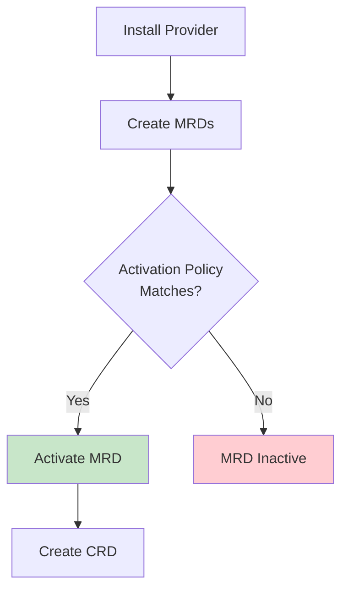

Managed Resource Definitions (MRDs) provide a lightweight abstraction over 
Kubernetes Custom Resource Definitions (CRDs) that enables selective 
installation and better documentation of managed resources.


MRDs are available in Crossplane v2.0+ as an alpha feature.


<!-- vale write-good.Passive = NO -->
## What are managed resource definitions
<!-- vale write-good.Passive = YES -->

A Managed Resource Definition (MRD) is essentially a CRD with extra 
metadata that provides:

* **Connection details schema** - Documents what connection details the 
  managed resource provides
* **Activation control** - Controls whether the underlying CRD gets installed 
  in your cluster
* **Resource discovery** - Makes it easier to understand what resources are 
  available

**Every managed resource in a provider package has an associated MRD.** The MRD 
contains the same schema as the CRD, plus extra Crossplane-specific 
metadata.


## Why use managed resource definitions

MRDs solve several challenges with traditional provider packages:

### Performance optimization
Installing a provider creates CRDs for _every_ managed resource the provider 
supports. For large providers like AWS, this can mean hundreds of CRDs that 
you may never use.

**MRDs let you install only the CRDs you need**, reducing Kubernetes API 
server overhead and improving cluster performance.

### Connection details discovery
Understanding what connection details a managed resource provides requires 
reading provider source code or trial-and-error testing.

**MRDs document connection details in the schema**, making it clear what 
credentials and endpoints each resource provides.

### Selective installation
Different environments may need different subsets of managed resources. A 
development environment might only need basic resources, while production 
needs the full set.

**MRDs enable environment-specific resource activation** through policies.

## How managed resource definitions work

When you install a provider package, Crossplane creates:

1. **MRDs for all resources** - Every managed resource gets an MRD
2. **CRDs only when activated** - Crossplane creates CRDs only for active MRDs
3. **Activation policies** - ManagedResourceActivationPolicy controls which 
   MRDs become active

### Managed resource definition lifecycle



### Managed resource definition states

MRDs can be in one of two states:

* **Active** - The underlying CRD exists and you can create managed resources
* **Inactive** - No CRD exists, managed resource creation fails

You can change an MRD's state by:
* Editing the MRD directly (`spec.state: Active`)
* Using a ManagedResourceActivationPolicy
* Provider package capabilities (safe-start)

## Connection details schema

MRDs document the connection details that managed resources provide. This makes 
it easier to understand what credentials and endpoints you get when creating 
resources.

```yaml
apiVersion: apiextensions.crossplane.io/v1alpha1
kind: ManagedResourceDefinition
metadata:
  name: instances.ec2.aws.crossplane.io
spec:
  connectionDetails:
  - name: endpoint
    description: The connection endpoint for the database
    type: string
  - name: port
    description: The port number for connections
    type: integer
  - name: username
    description: The master username for the database
    type: string
  - name: password
    description: The master password for the database
    type: string
    fromConnectionSecretKey: password
```

The `connectionDetails` field documents:
* **Connection detail names** - What keys appear in connection secrets
* **Descriptions** - What each connection detail contains
* **Types** - The data each detail's type
* **Source keys** - How details map from provider responses

<!-- vale Google.Headings = NO -->
## Managed Resource Activation Policy
<!-- vale Google.Headings = YES -->

ManagedResourceActivationPolicy (MRAP) provides pattern-based control over 
which MRDs become active. Pattern-based control is more scalable than manually activating 
individual MRDs.

```yaml
apiVersion: apiextensions.crossplane.io/v1alpha1
kind: ManagedResourceActivationPolicy
metadata:
  name: aws-core-resources
spec:
  activations:
  - "instances.ec2.aws.crossplane.io"      # Specific MRD
  - "*.rds.aws.crossplane.io"             # All RDS resources
  - "buckets.s3.aws.crossplane.io"        # S3 buckets
```

### Activation patterns

MRAP supports several activation patterns:

* **Exact match**: `instances.ec2.aws.crossplane.io`
* **Wildcard prefix**: `*.rds.aws.crossplane.io` (all RDS resources)
* **Provider wildcard**: `*.aws.crossplane.io` (all AWS resources)

Multiple MRAPs can exist, and their activations combine.

## Provider capabilities

Providers can declare capabilities that affect MRD behavior:

<!-- vale Google.Headings = NO -->
### safe-start capability
<!-- vale Google.Headings = YES -->
Providers with the `safe-start` capability start with all MRDs inactive by 
default. This prevents performance issues when installing large providers.

Without safe-start, all MRDs are active by default for backward compatibility.

```yaml
# In provider package metadata
spec:
  capabilities:
  - name: safe-start
```


Implementing safe-start requires significant provider code changes. Provider 
developers should follow the 
[safe-start implementation guide]() 
for detailed technical requirements and examples.


<!-- vale Google.Headings = NO -->
### safe-start implementation examples
<!-- vale Google.Headings = YES -->

The Crossplane community has implemented safe-start in several providers:

* **provider-nop** - [Reference implementation](https://github.com/crossplane-contrib/provider-nop/pull/24) 
  showing safe-start integration with both namespaced and cluster-scoped resources
* **provider-aws** - Large provider demonstrating safe-start performance benefits

These implementations provide real-world examples of:
- MRD controller integration
- Build process modifications  
- Testing strategies for safe-start behavior
- Migration approaches for existing users

## Key concepts

Understanding these terms helps when working with MRDs:

* **MRD** - The definition that may or may not have an active CRD
* **MRAP** - Policy that controls which MRDs become active
* **Active state** - MRD has an underlying CRD, you can create resources
* **Inactive state** - No CRD exists, resource creation fails
* **safe-start** - Provider capability that defaults MRDs to inactive
* **Connection details schema** - Documentation of what connection details 
  a managed resource provides

## Relationship to other Crossplane features

MRDs integrate with existing Crossplane concepts:

* **Providers** - Create MRDs when installed
* **Managed resources** - You can only create when their MRD is active
* **Compositions** - Can reference both active and inactive managed resources 
  (composition validation occurs at render time)
* **Claims** - Work after the underlying managed resources are active

MRDs are backward compatible. Existing providers and compositions continue to 
work without modification.