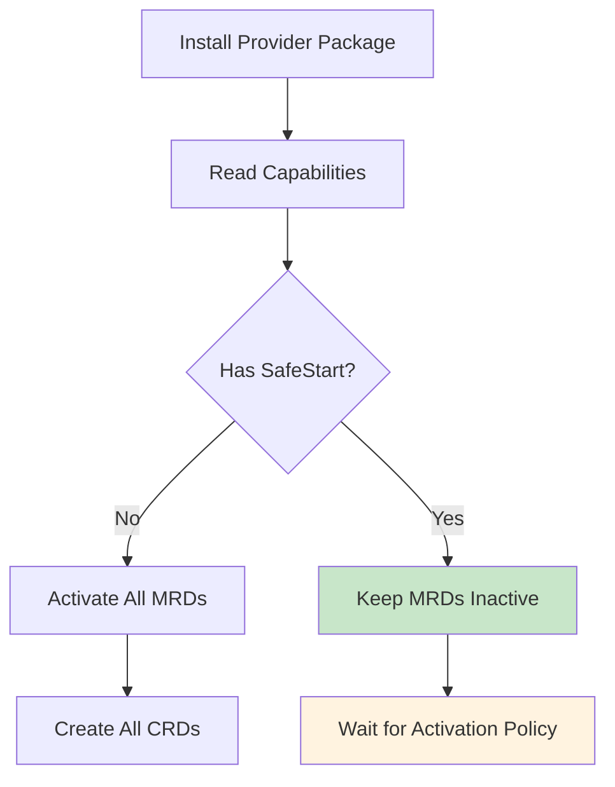

Provider capabilities are declarative features that providers can implement to 
modify their behavior and integration with Crossplane. Capabilities enable 
providers to opt into new features while maintaining backward compatibility.

## What are provider capabilities?

Provider capabilities are metadata declarations in provider packages that tell 
Crossplane how the provider should behave. They're similar to feature flags 
but are declared at the package level.

```yaml
# In provider package metadata
apiVersion: meta.pkg.crossplane.io/v1alpha1
kind: Provider
metadata:
  name: provider-aws
spec:
  capabilities:
  - name: SafeStart
  - name: CustomCapability
```

Crossplane reads these capabilities and modifies its behavior when installing 
and managing the provider.

## Available capabilities

### SafeStart

The `SafeStart` capability changes how Managed Resource Definitions (MRDs) are 
activated when the provider is installed.

**Without SafeStart:**
- All MRDs are automatically activated
- All corresponding CRDs are created immediately
- Compatible with legacy providers and existing workflows

**With SafeStart:**
- All MRDs start in `Inactive` state
- No CRDs are created until MRDs are explicitly activated
- Reduces initial resource overhead and improves performance

```yaml
spec:
  capabilities:
  - name: SafeStart
```


SafeStart is particularly valuable for large providers like AWS that define 
hundreds of managed resources. It prevents performance issues by avoiding the 
creation of unused CRDs.


#### When to use SafeStart

Use SafeStart when:
* Your provider defines many managed resources (>50)
* Users typically need only a subset of available resources
* Installation performance and resource usage are concerns
* You want to provide better resource discovery through MRDs

Don't use SafeStart when:
* Your provider has few managed resources (<20)
* Most users need all available resources
* Backward compatibility with existing installations is critical
* Your users aren't ready to manage resource activation

## Capability matching

Crossplane supports flexible matching for capability names:

* **Exact match**: `SafeStart`
* **Case variations**: `safestart`, `safe-start`, `SafeStart`
* **Fuzzy matching**: Handles common spelling variations

This flexibility prevents issues when providers use different naming conventions.

## How capabilities affect installation

The provider installation process changes based on declared capabilities:



## Provider compatibility

### Legacy providers

Providers without any capabilities work exactly as before:
* All MRDs are active by default
* All CRDs are created immediately
* No changes required for existing compositions or configurations

### Modern providers

Providers with SafeStart capability require additional setup:
* Create ManagedResourceActivationPolicy to activate needed resources
* Verify required CRDs exist before creating managed resources  
* Use MRD connection details documentation for resource planning

## Implementing SafeStart in providers

SafeStart implementation requires several technical changes to provider code and 
build processes. This section provides an overview - see the 
[complete SafeStart implementation guide]() 
for detailed instructions.

### Key implementation requirements

**Code changes:**
- Add MRD controller logic to handle activation/deactivation
- Support both namespaced and cluster-scoped resources
- Generate MRDs with connection details documentation
- Implement CRD lifecycle management

**Build process changes:**
- Update Makefile to generate MRDs alongside CRDs
- Modify CI/CD to test SafeStart behavior
- Include MRDs in provider package artifacts

**RBAC updates:**
SafeStart providers need additional permissions to manage CRDs dynamically:

```yaml
apiVersion: rbac.authorization.k8s.io/v1
kind: ClusterRole  
metadata:
  name: my-provider-system
rules:
# Standard provider permissions
- apiGroups: [""]
  resources: ["events"]
  verbs: ["create", "update", "patch"]
  
# Additional SafeStart permissions
- apiGroups: ["apiextensions.k8s.io"]
  resources: ["customresourcedefinitions"] 
  verbs: ["get", "list", "watch", "create", "update", "patch", "delete"]
- apiGroups: ["apiextensions.crossplane.io"]
  resources: ["managedresourcedefinitions"]
  verbs: ["get", "list", "watch", "update", "patch"]
```

### Provider package metadata

Declare SafeStart capability in your provider package:

```yaml
apiVersion: meta.pkg.crossplane.io/v1
kind: Provider
metadata:
  name: my-provider
spec:
  package: registry.example.com/my-provider:v2.0.0
  capabilities:
  - name: SafeStart
```

### MRD generation with connection details

Generate MRDs that document connection details for better user experience:

```yaml
apiVersion: apiextensions.crossplane.io/v1alpha1
kind: ManagedResourceDefinition
metadata:
  name: databases.rds.aws.example.io
spec:
  group: rds.aws.example.io
  names:
    kind: Database
    plural: databases
  scope: Namespaced
  
  # Connection details documentation
  connectionDetails:
  - name: endpoint
    description: "The RDS instance connection endpoint"
    type: string
    fromConnectionSecretKey: endpoint
  - name: port
    description: "The port number for database connections" 
    type: integer
    fromConnectionSecretKey: port
  - name: username
    description: "The master username for the database"
    type: string
    fromConnectionSecretKey: username
  - name: password
    description: "The master password for the database"
    type: string
    fromConnectionSecretKey: password
```

### Implementation examples

The [provider-nop SafeStart implementation](https://github.com/crossplane-contrib/provider-nop/pull/24) 
demonstrates:
- Adding both namespaced and cluster-scoped resource variants
- MRD controller integration
- Build process updates for SafeStart support
- Testing strategies for SafeStart behavior


See the [complete SafeStart implementation guide]() 
for step-by-step instructions, code examples, and testing strategies.


### Migration considerations

When adding SafeStart to existing providers:

**Backward compatibility:**
- Existing provider installations continue working unchanged
- New installations start with inactive MRDs
- Provide migration documentation for users

**Version strategy:**
```yaml
# Document version compatibility clearly
# Provider v1.x: Traditional CRD installation  
# Provider v2.0+: SafeStart support with MRDs
```

## Best practices

### For provider developers

**Do use SafeStart when:**
* Your provider has >50 managed resources
* Resource activation patterns vary by environment
* Performance optimization is important

**Document capabilities clearly:**
* Explain what each capability does
* Provide migration guides for existing users
* Include examples of activation policies

**Test compatibility:**
* Verify behavior with and without capabilities
* Test with different Crossplane versions
* Validate RBAC permissions

### For platform operators

**Plan activation policies:**
```yaml
# Development environment - minimal resources
apiVersion: apiextensions.crossplane.io/v1alpha1
kind: ManagedResourceActivationPolicy
metadata:
  name: dev-resources
spec:
  activations:
  - "databases.*.example.com"
  - "buckets.*.example.com"

---
# Production environment - comprehensive resources  
apiVersion: apiextensions.crossplane.io/v1alpha1
kind: ManagedResourceActivationPolicy
metadata:
  name: prod-resources
spec:
  activations:
  - "*.example.com"  # Activate all resources
```

**Monitor activation status:**
```shell
# Check which MRDs are active
kubectl get mrds -l provider=my-provider

# Verify activation policies
kubectl get mrap -o wide

# Monitor resource usage
kubectl top nodes
```

## Future capabilities

The capability system is extensible. Future capabilities might include:

* **ResourceQuotas** - Automatic resource limit management
* **NetworkPolicies** - Provider-specific network isolation
* **CustomValidation** - Enhanced resource validation
* **TelemetryOpt** - Telemetry and observability features

## Troubleshooting capabilities

### Common issues

**MRDs not activating:**
```shell
# Check if provider has SafeStart capability
kubectl get provider my-provider -o yaml | grep -A5 capabilities

# Verify activation policy exists and matches
kubectl get mrap
kubectl describe mrap my-policy
```

**CRDs not created:**
```shell
# Check MRD activation status
kubectl get mrd my-resource.example.com

# Look for controller errors
kubectl logs -n crossplane-system deployment/crossplane
```

**Provider installation fails:**
```shell
# Check provider conditions
kubectl describe provider my-provider

# Look for RBAC issues
kubectl get events --field-selector reason=FailedCreate
```

### Debug commands

```shell
# List all providers and their capabilities
kubectl get providers -o jsonpath='{range .items[*]}{.metadata.name}: {.spec.capabilities[*].name}{"\n"}{end}'

# Check MRD activation across providers
kubectl get mrds --show-labels

# Verify CRD creation matches activation
kubectl get crds | grep example.com | wc -l
kubectl get mrds -l state=Active | wc -l
```

## Relationship to other features

Provider capabilities integrate with:

* **MRDs** - SafeStart controls default activation state
* **Activation policies** - Work together to control resource availability  
* **Package manager** - Capabilities are read during package installation
* **RBAC** - Some capabilities require additional permissions
* **Compositions** - May need updates when capabilities change resource availability

Capabilities provide a foundation for evolving provider behavior while 
maintaining compatibility with existing Crossplane installations.