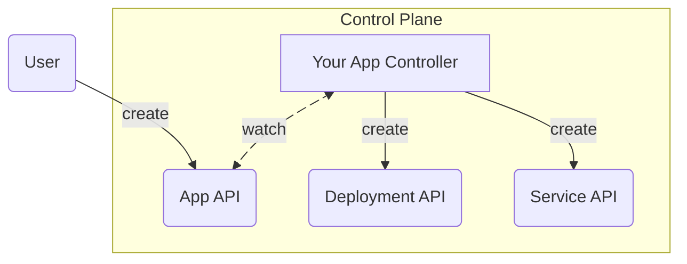
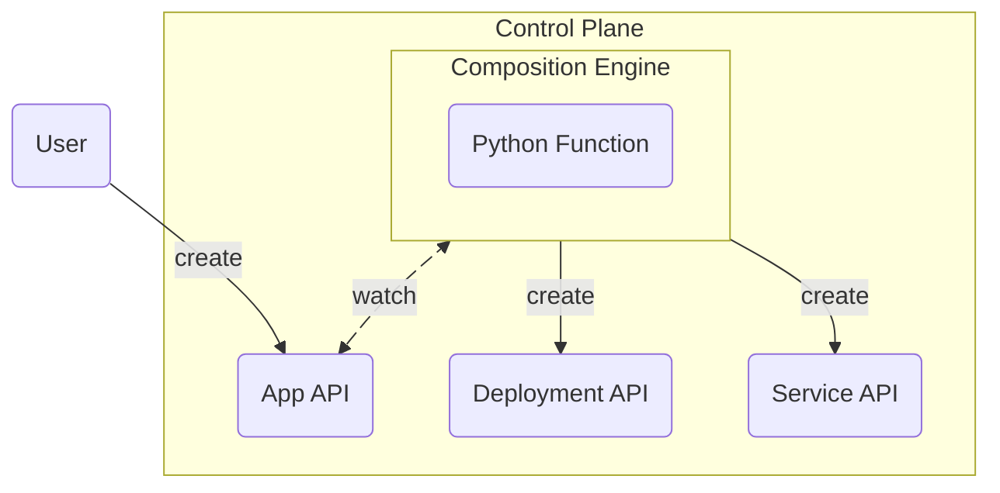
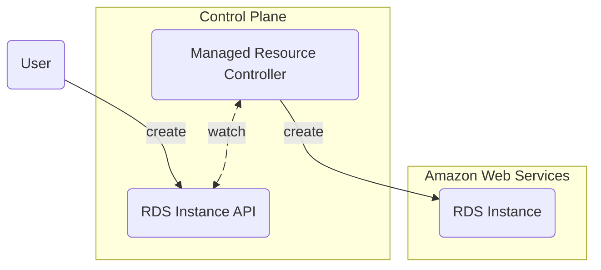
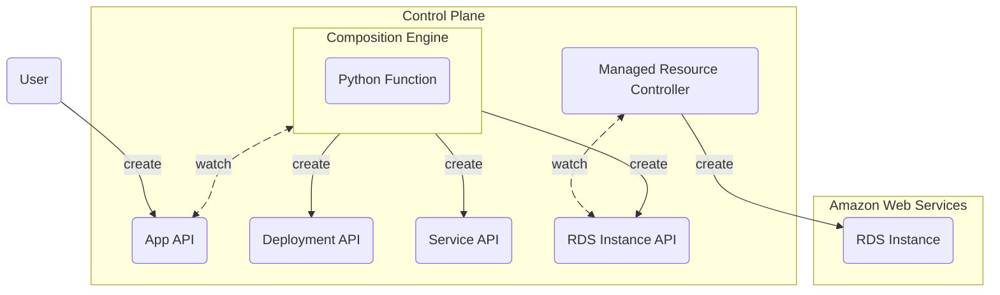
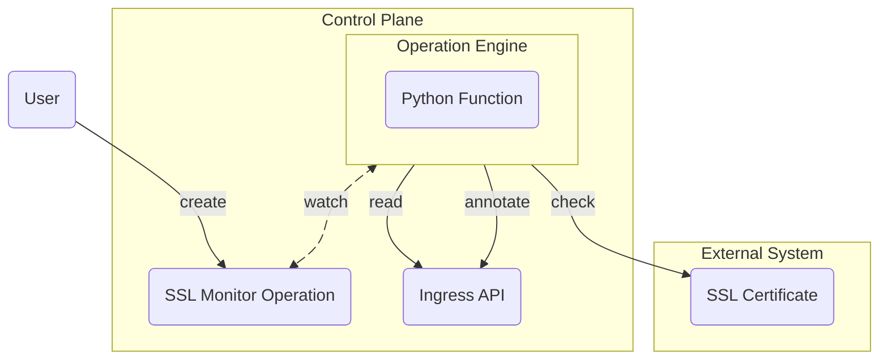

Crossplane is a control plane framework for platform engineering. 

**Crossplane lets you build control planes to manage your cloud native software.**
It lets you design the APIs and abstractions that your users use to interact
with your control planes.


**A control plane is software that controls other software.**

Control planes are a core cloud native pattern. The major cloud providers are
all built using control planes.

Control planes expose an API. You use the API to tell the control plane what
software it should configure and how - this is your _desired state_.

A control plane can configure any cloud native software. It could deploy an app,
create a load balancer, or create a GitHub repository.

The control plane configures your software, then monitors it throughout its
lifecycle. If your software ever _drifts_ from your desired state, the control
plane automatically corrects the drift.


Crossplane has a rich ecosystem of extensions that make building a control plane
faster and easier. It's built on Kubernetes, so it works with all the Kubernetes
tools you already use.

**Crossplane's key value is that it unlocks the benefits of building your own
Kubernetes custom resources without having to write controllers for them.**

Not familiar with Kubernetes custom resources and controllers?
[This DevOps Toolkit video](https://www.youtube.com/watch?v=aM2Y9m2Kazk) has a
great explanation.


Kubebuilder is a popular project for building Kubernetes controllers. Look at
the [Kubebuilder documentation](https://book.kubebuilder.io) to see what's
involved in writing a controller.


## Crossplane components

Crossplane has three major components:

* [Composition](#composition)
* [Managed resources](#managed-resources)
* [Operations](#operations)
* [Package manager](#package-manager)

You can use all three components to build your control plane, or pick only the
ones you need.

### Composition

Composition lets you build custom APIs to control your cloud native software.

Crossplane extends Kubernetes. You build your custom APIs by using Crossplane to
extend Kubernetes with new custom resources.

**To extend Kubernetes without using Crossplane you need a Kubernetes
controller.** The controller is the software that reacts when a user calls the
custom resource API.

Say you want your control plane to serve an `App` custom resource API. When
someone creates an `App`, the control plane should create a Kubernetes
`Deployment` and a `Service`.

**If there's not already a controller that does what you want - and exposes the
API you want - you have to write the controller yourself.**

**With Crossplane you don't have to write a controller**. Instead you configure
a pipeline of functions. The functions return declarative configuration that
Crossplane should apply.

With Composition you avoid writing and maintaining complex controller code
that's hard to get right. Instead you focus on expressing your business
logic, and work in your preferred language.


Composition functions are like configuration language plugins.

Functions allow you to write your configuration in multiple languages, including
[YAML](https://yaml.org), [KCL](https://www.kcl-lang.io),
[Python](https://python.org), and [Go](https://go.dev).


You can use composition together with [managed resources](#managed-resources) to
build new custom resource APIs powered by managed resources.

Follow [Get Started with Composition]()
to see how composition works.

### Managed resources

Managed resources (MRs) are ready-made Kubernetes custom resources. 

Each MR extends Kubernetes with the ability to manage a new system. For example
there's an RDS instance MR that extends Kubernetes with the ability to manage
[AWS RDS](https://aws.amazon.com/rds/) instances.

Crossplane has an extensive library of managed resources you can use to manage
almost any cloud provider, or cloud native software.

**With Crossplane you don't have to write a controller if you want to manage
something outside of your Kubernetes cluster using a custom resource.** There's
already a Crossplane managed resource for that.

You can use managed resources together with [composition](#composition) to build
new custom resource APIs powered by MRs.

Follow [Get Started with Managed Resources]()
to see how managed resources work.


Only AWS managed resources support the Crossplane v2 preview.

<!-- vale gitlab.FutureTense = NO -->
Maintainers will update the managed resources for other systems including Azure,
GCP, Terraform, Helm, GitHub, etc to support Crossplane v2 soon.
<!-- vale gitlab.FutureTense = YES -->


### Operations

Operations let you run operational tasks using function pipelines.

While composition and managed resources focus on creating and managing
infrastructure, operations handle tasks that don't fit the typical resource
creation pattern - like certificate monitoring, rolling upgrades, or scheduled
maintenance.

**Operations run function pipelines to completion like a Kubernetes Job.**
Instead of continuously managing resources, they perform specific tasks and
report the results.

<!-- vale Google.WordList = NO -->
Say you want your control plane to watch SSL certificates on Kubernetes
`Ingress` resources. When someone creates an Operation, the control plane
should check the certificate and annotate the `Ingress` with expiry information.
<!-- vale Google.WordList = YES -->

Operations support three modes:

* **Operation** - Run once to completion
* **CronOperation** - Run on a scheduled basis
* **WatchOperation** - Run when resources change

You can use operations alongside composition and managed resources to build
complete operational workflows for your control plane.

Follow [Get Started with Operations]()
to see how operations work.


Operations are an alpha feature available in Crossplane v2.


### Package manager

The Crossplane package manager lets you install new managed resources and
composition functions.

You can also package any part of a control plane's configuration and install it
using the package manager. This allows you to deploy multiple control planes with
identical capabilities - for example one control plane per region or per
service.

Read about Crossplane [packages]()
to learn about the package manager.