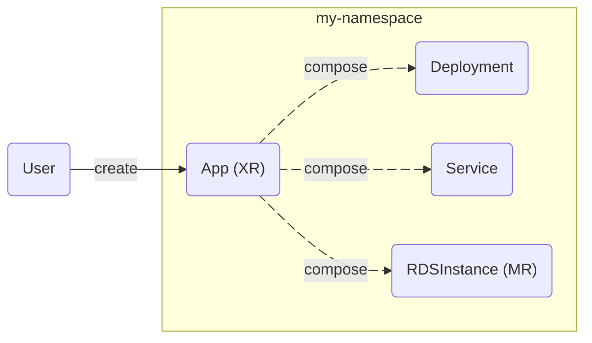
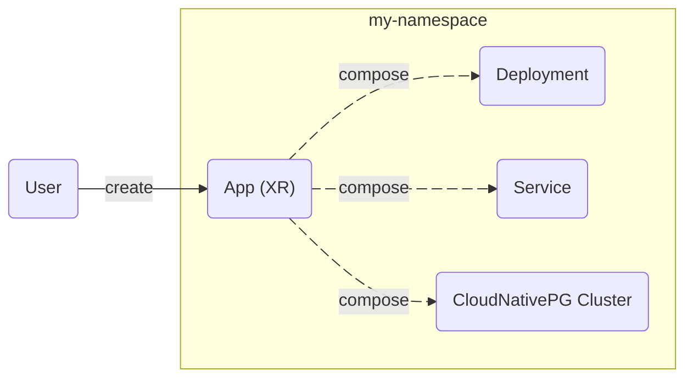

**Crossplane v2 makes Crossplane more useful, more intuitive, and less
opinionated.**

Crossplane v2 makes four major changes:

* **Composite resources are now namespaced**
* **Managed resources are now namespaced**
* **Composition supports any Kubernetes resource**
* **Operations enable operational workflows**

**Crossplane v2 is better suited to building control planes for applications,
not just infrastructure.** It removes the need for awkward abstractions like
claims and provider-kubernetes Objects.




Most users can upgrade to Crossplane v2 without breaking changes.

Read about Crossplane v2's [backward compatibility](#backward-compatibility).



This page assumes you're familiar with Crossplane. New to Crossplane? Read
[What's Crossplane]() instead.



## Namespaced composite resources

Crossplane v2 makes composite resources (XRs) namespaced by default.

A namespaced XR can compose any resource ([not just Crossplane resources](#compose-any-resource))
in its namespace.

A namespaced XR looks like this:

```yaml
apiVersion: example.crossplane.io/v1
kind: App
metadata:
  namespace: default
  name: my-app
spec:
  image: nginx
  crossplane:
    compositionRef:
      name: app-kcl
    compositionRevisionRef:
      name: app-kcl-41b6efe
    resourceRefs:
    - apiVersion: apps/v1
      kind: Deployment
      name: my-app-9bj8j
    - apiVersion: v1
      kind: Service
      name: my-app-bflc4
```


Crossplane v2 moves all an XR's "Crossplane machinery" under `spec.crossplane`.
This makes it easier for users to tell which fields are important to them, and
which are just "Crossplane stuff" they can ignore.


Composite resource definitions (XRDs) now have a `scope` field. The `scope`
field defaults to `Namespaced` in the new v2 version of the XRD API.

```yaml
apiVersion: apiextensions.crossplane.io/v2
kind: CompositeResourceDefinition
metadata:
  name: apps.example.crossplane.io
spec:
  scope: Namespaced
  group: example.crossplane.io
  names:
    kind: App
    plural: apps
  versions:
  - name: v1
  # Removed for brevity
```

You can also set the `scope` field to `Cluster` to create a cluster scoped XR. A
cluster scoped XR can compose any cluster scoped resource. A cluster scoped XR
can also compose any namespaced resource in any namespace.

With namespaced XRs there's no longer a need for claims. **The new namespaced
and cluster scoped XRs in Crossplane v2 don't support claims.**


Crossplane v2 is backward compatible with v1-style XRs.

When you use v1 of the XRD API `scope` defaults to `LegacyCluster`
mode. `LegacyCluster` XRs support claims and don't use `spec.crossplane`.

Read more about Crossplane v2's [backward compatibility](#backward-compatibility).


## Namespaced managed resources

Crossplane v2 makes all managed resources (MRs) namespaced.

This enables a namespaced XR to consist of entirely namespaced resources.
These resources can be a Crossplane MR like an `RDSInstance`, a Kubernetes
resource like a `Deployment`, or a third party custom resource like a
[Cluster API](https://cluster-api.sigs.k8s.io) `Cluster`.

A namespaced MR looks like this:

```yaml
apiVersion: s3.aws.m.upbound.io/v1beta1
kind: Bucket
metadata:
  namespace: default
  generateName: my-bucket
spec:
  forProvider:
    region: us-east-2
```

Namespaced MRs work great with or without composition. Crossplane v2 isn't
opinionated about using composition and MRs together. Namespaces enable fine
grained access control over who can create what MRs.


Namespaced AWS managed resources are fully available in Crossplane v2.

<!-- vale gitlab.FutureTense = NO -->
Maintainers are actively working to update managed resources for other systems including Azure,
GCP, Terraform, Helm, GitHub, etc to support namespaced MRs.
<!-- vale gitlab.FutureTense = YES -->



Crossplane v2 is backward compatible with v1-style cluster scoped MRs.

<!-- vale gitlab.FutureTense = NO -->
New provider releases will support both namespaced and cluster scoped MRs.
Crossplane v2 considers cluster scoped MRs a legacy feature. Crossplane will
deprecate and remove cluster scoped MRs at a future date.
<!-- vale gitlab.FutureTense = YES -->

Read more about Crossplane v2's [backward compatibility](#backward-compatibility).


Crossplane v2 also introduces 
[managed resource definitions]() 
for selective activation of provider resources, reducing cluster overhead by 
installing only the managed resources you actually need.

## Compose any resource

Crossplane v2 isn't opinionated about using composition together with managed
resources.

You can create a composite resource (XR) that composes any resource.
This includes a Crossplane MR like an `RDSInstance`, a Kubernetes resource like
a `Deployment`, or a third party custom resource like a
[CloudNativePG](https://cloudnative-pg.io) PostgreSQL `Cluster`.



This opens composition to exciting new use cases - for example building custom
app models with Crossplane.


You must grant Crossplane access to compose resources that aren't Crossplane
resources like MRs or XRs. Read
[the composition documentation]()
to learn how to grant Crossplane access.


## Operations enable operational workflows

Crossplane v2 introduces Operations - a new way to run operational tasks using
function pipelines.

Operations handle tasks that don't fit the typical resource creation pattern.
Things like certificate monitoring, rolling upgrades, scheduled maintenance, or
responding to resource changes.

**Operations run function pipelines to completion, like a Kubernetes Job.**
Instead of continuously managing resources, they perform specific tasks and
report the results.

```yaml
apiVersion: ops.crossplane.io/v1alpha1
kind: CronOperation
metadata:
  name: cert-monitor
spec:
  schedule: "0 6 * * *"  # Daily at 6 AM
  mode: Pipeline
  pipeline:
  - step: check-certificates
    functionRef:
      name: crossplane-contrib-function-python
    # function checks SSL certificates and reports status
```

Operations support three modes:

* **Operation** - Run once to completion
* **CronOperation** - Run on a scheduled basis  
* **WatchOperation** - Run when resources change

Operations can read existing resources and optionally change them. This enables
workflows like annotating resources with operational data, triggering
maintenance tasks, or implementing custom operational policies.


Operations are an alpha feature in Crossplane v2.


## Backward compatibility

Crossplane v2 makes the following breaking changes:

* It removes native patch and transform composition.
* It removes the `ControllerConfig` type.
* It removes support for external secret stores.
* It removes the default registry for Crossplane Packages.

Crossplane deprecated native patch and transform composition in Crossplane
v1.17. It's replaced by composition functions.

Crossplane deprecated the `ControllerConfig` type in v1.11. It's replaced by the
`DeploymentRuntimeConfig` type.

Crossplane added external secret stores in v1.7. External secret stores have
remained in alpha for over two years and are now unmaintained.

Crossplane v2 drops the `--registry` flag that allowed users to specify a default
registry value. Users must now always specify a fully qualified URL when
installing packages, both directly via `spec.package` and indirectly as
dependencies. Using fully qualified images was already a best practice. It's now
enforced to avoid confusion and unexpected behavior, ensuring users are aware of
the registry used by their packages.


As long as you're not using these deprecated or alpha features, Crossplane v2 is
backward compatible with Crossplane v1.x.



Before upgrading to Crossplane v2, ensure all your Packages are using fully
qualified images that explicitly specify a registry (`registry.example.com/repo/package:tag`).

Run `kubectl get pkg` to look for any packages that aren't fully qualified, then
update or rebuild any Packages to use fully qualified images as needed.


Crossplane v2 supports legacy v1-style XRs and MRs. Most users can upgrade from 
v1.x to Crossplane v2 without breaking changes.

Existing Compositions require minor updates to work with Crossplane v2
style XRs and MRs. Follow the [Crossplane v2 upgrade guide]() 
for step-by-step migration instructions.
