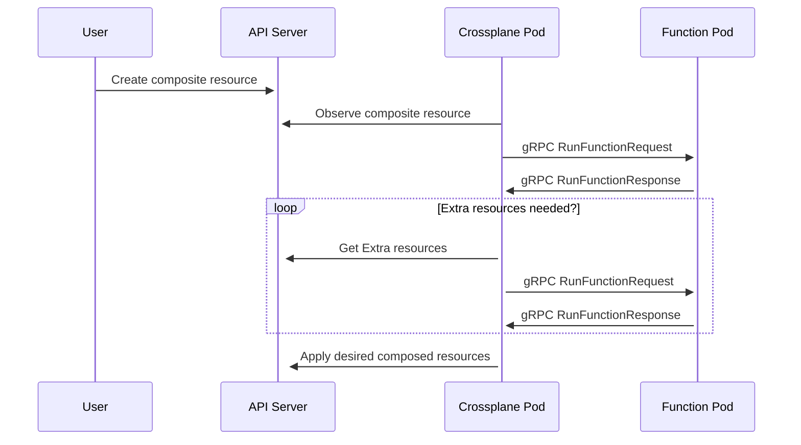

Composition functions (or just functions, for short) are custom programs that
template Crossplane resources. Crossplane calls composition functions to
determine what resources it should create when you create a composite resource
(XR). You can write a function to template resources using a general purpose
programming language like Go or Python. Using a general purpose programming
language allows a Function to use more advanced logic to template resources,
like loops and conditionals.

You can build a function using general purpose programming languages such as Go
or Python. The Crossplane community has also built functions that let you
template Crossplane resources using [CUE](https://cuelang.org), Helm-like
[Go templates](https://pkg.go.dev/text/template) or
[Patch and Transforms]().

## Install a composition function

Installing a Function creates a function pod. Crossplane sends requests to this
pod to ask it what resources to create when you create a composite resource.

Install a Function with a Crossplane
Function object setting the
spec.package value to the
location of the function package.


For example, to install [Function Patch and Transform](https://github.com/crossplane-contrib/function-patch-and-transform),

```yaml {label="install"}
apiVersion: pkg.crossplane.io/v1beta1
kind: Function
metadata:
  name: function-patch-and-transform
spec:
  package: xpkg.upbound.io/crossplane-contrib/function-patch-and-transform:v0.1.4
```


Functions are Crossplane Packages. Read more about Packages in the
[Packages documentation]().


By default, the Function pod installs in the same namespace as Crossplane
(`crossplane-system`).

## Verify a composition function

View the status of a Function with `kubectl get functions`

During the install a Function reports `INSTALLED` as `True` and `HEALTHY` as
`Unknown`.

```shell {copy-lines="1"}
kubectl get functions
NAME                              INSTALLED   HEALTHY   PACKAGE                                                                  AGE
function-patch-and-transform      True        Unknown   xpkg.upbound.io/crossplane-contrib/function-patch-and-transform:v0.1.4   10s
```

After the Function install completes and it's ready for use the `HEALTHY` status
reports `True`.

## Use a function in a composition

Crossplane calls a Function to determine what resources it should create when
you create a composite resource. The Function also tells Crossplane what to do
with these resources when you update or delete a composite resource.

When Crossplane calls a Function it sends it the current state of the composite
resource. It also sends it the current state of any managed resources the
composite resource owns.

Crossplane knows what Function to call when a composite resource changes by
looking at the Composition the composite resource uses.


Crossplane has four core components that users commonly mix up:

* [Composition]() - A template to define how to create
  resources.
* [CompositeResourceDefinition]()
  (`XRD`) - A custom API specification. 
* [Composite Resource]() (`XR`) - Created by
  using the custom API defined in a CompositeResourceDefinition. XRs use the
  Composition template to create new managed resources. 
* [Claim]() (`XRC`) - Like a Composite Resource, but with
  namespace scoping. 


To use composition functions set the Composition 
mode to
Pipeline.

Define a pipeline of 
steps. Each 
step calls a Function.  

Each step uses a 
functionRef to reference the
name of the Function to call. 


Compositions using mode: Pipeline 
can't specify resource templates with a `resources` field. 

Use function "Patch and Transform" to create resource templates.



Some Functions also allow you to specify an 
input.  
The function defines the
kind of input.

This example uses
[Function Patch and Transform](https://github.com/crossplane-contrib/function-patch-and-transform).  
Function Patch and Transform implements Crossplane resource
templates.  
The input kind is Resources, 
and it accepts [Patch and Transform]() 
resources as input.

```yaml {label="single",copy-lines="none"}
apiVersion: apiextensions.crossplane.io/v1
kind: Composition
# Removed for Brevity
spec:
  # Removed for Brevity
  mode: Pipeline
  pipeline:
  - step: patch-and-transform
    functionRef:
      name: function-patch-and-transform
    input:
      apiVersion: pt.fn.crossplane.io/v1beta1
      kind: Resources
      resources:
      - name: storage-bucket
        base:
          apiVersion: s3.aws.upbound.io/v1beta1
          kind: Bucket
          spec:
            forProvider:
              region: "us-east-2"
```


## Use a pipeline of functions in a composition

Crossplane can ask more than one Function what to do when a composite resource
changes. When a Composition has a pipeline of two or more steps, Crossplane
calls them all. It calls them in the order they appear in the pipeline.

Crossplane passes each Function in the pipeline the result of the previous
Function. This enables powerful combinations of Functions. In this example,
Crossplane calls function-cue to
create an S3 bucket. Crossplane then passes the bucket to 
function-auto-ready, which marks the
composite resource as ready when the bucket becomes ready.

```yaml {label="double",copy-lines="none"}
apiVersion: apiextensions.crossplane.io/v1
kind: Composition
# Removed for Brevity
spec:
  # Removed for Brevity
  mode: Pipeline
  pipeline:
  - step: cue-export-resources
    functionRef:
      name: function-cue
    input:
      apiVersion: cue.fn.crossplane.io/v1beta1
      kind: CUEInput
      name: storage-bucket
      export:
        target: Resources
        value: |
          apiVersion: "s3.aws.upbound.io/v1beta1"
          kind: "Bucket"
          spec: forProvider: region: "us-east-2"
  - step: automatically-detect-readiness
    functionRef:
      name: function-auto-ready
```

## Test a composition that uses functions

You can preview the output of any composition that uses composition functions
using the Crossplane CLI. You don't need a Crossplane control plane to do
this. The Crossplane CLI uses Docker Engine to run functions.



See the [Crossplane CLI docs]() to
learn how to install and use the Crossplane CLI.



Running `crossplane beta render` requires [Docker](https://www.docker.com).


Provide a composite resource, composition and composition functions to render
the output locally. 

```shell
crossplane beta render xr.yaml composition.yaml functions.yaml
```

`crossplane beta render` prints resources as YAML to stdout. It prints the
composite resource first, followed by the resources the composition functions
created.

```yaml
---
apiVersion: example.crossplane.io/v1
kind: XBucket
metadata:
  name: example-render
---
apiVersion: s3.aws.upbound.io/v1beta1
kind: Bucket
metadata:
  annotations:
    crossplane.io/composition-resource-name: storage-bucket
  generateName: example-render-
  labels:
    crossplane.io/composite: example-render
  ownerReferences:
  - apiVersion: example.crossplane.io/v1
    blockOwnerDeletion: true
    controller: true
    kind: XBucket
    name: example-render
    uid: ""
spec:
  forProvider:
    region: us-east-2
```



You can recreate the output below using by running `crossplane beta render` with
these files.

The `xr.yaml` file contains the composite resource to render:

```yaml
apiVersion: example.crossplane.io/v1
kind: XBucket
metadata:
  name: example-render
spec:
  bucketRegion: us-east-2
```

The `composition.yaml` file contains the Composition to use to render the
composite resource:

```yaml
apiVersion: apiextensions.crossplane.io/v1
kind: Composition
metadata:
  name: example-render
spec:
  compositeTypeRef:
    apiVersion: example.crossplane.io/v1
    kind: XBucket
  mode: Pipeline
  pipeline:
  - step: patch-and-transform
    functionRef:
      name: function-patch-and-transform
    input:
      apiVersion: pt.fn.crossplane.io/v1beta1
      kind: Resources
      resources:
      - name: storage-bucket
        base:
          apiVersion: s3.aws.upbound.io/v1beta1
          kind: Bucket
        patches:
        - type: FromCompositeFieldPath
          fromFieldPath: spec.bucketRegion
          toFieldPath: spec.forProvider.region
```

The `functions.yaml` file contains the Functions the Composition references in
its pipeline steps:

```yaml
---
apiVersion: pkg.crossplane.io/v1beta1
kind: Function
metadata:
  name: function-patch-and-transform
spec:
  package: xpkg.upbound.io/crossplane-contrib/function-patch-and-transform:v0.1.4
```


The Crossplane CLI uses Docker Engine to run functions. You can change how the
Crossplane CLI run a function by adding an annotation in `functions.yaml`. Add
the `render.crossplane.io/runtime` annotation to a Function to change how it's
run.

`crossplane beta render` supports two `render.crossplane.io/runtime` values:

* `Docker` (the default) connects to Docker Engine. It uses Docker to pull and
  run a function runtime.
* `Development` connects to a function runtime you have run manually.

When you use the Development
runtime the Crossplane CLI ignores the Function's package. Instead it expects you to make sure the function
is listening on localhost port 9443. The function must be listening without gRPC
transport security. Most function SDKs let you run a function with the
`--insecure` flag to disable transport security. For example you can run a Go
function locally using `go run . --insecure`.

```yaml {label="development"}
apiVersion: pkg.crossplane.io/v1beta1
kind: Function
metadata:
  name: function-patch-and-transform
  annotations:
    render.crossplane.io/runtime: Development
spec:
  package: xpkg.upbound.io/crossplane-contrib/function-patch-and-transform:v0.1.4
```


Use the `Development` runtime when you
[write a composition function](#write-a-composition-function) to test your
function end-to-end.


`crossplane beta render` also supports the following Function annotations. These
annotations affect how it runs Functions:

* `render.crossplane.io/runtime-docker-cleanup` - When using the `Docker`
runtime this annotation specifies whether the CLI should stop the function
container after it calls the function. It supports the values `Stop`, to stop
the container, and `Orphan`, to leave it running.
* `render.crossplane.io/runtime-docker-pull-policy` - When using the `Docker`
  runtime this annotation specifies when the CLI should pull the Function's
  package. It supports the values `Always`, `Never`, and `IfNotPresent`.
* `render.crossplane.io/runtime-development-target` - When using the
  `Development` runtime this annotation tells the CLI to connect to a Function
  running at the specified target. It uses
  [gRPC target syntax](https://github.com/grpc/grpc/blob/v1.59.1/doc/naming.md).

## Write a composition function

Composition functions let you replace complicated Compositions with code written
in your programming language of choice. Crossplane has tools, software
development kits (SDKs) and templates to help you write a function.


<!-- vale write-good.Passive = NO -->
Here's an example of a tiny, hello world function. This example is written in
[Go](https://go.dev).
<!-- vale write-good.Passive = YES -->

```go
func (f *Function) RunFunction(_ context.Context, req *fnv1beta1.RunFunctionRequest) (*fnv1beta1.RunFunctionResponse, error) {
        rsp := response.To(req, response.DefaultTTL)
        response.Normal(rsp, "Hello world!")
        return rsp, nil
}
```

Some people design composition functions for you to use them with any kind of
composite resource.
[Function Patch and Transform](https://github.com/crossplane-contrib/function-patch-and-transform)
and
[Function Auto Ready](https://github.com/crossplane-contrib/function-auto-ready)
work with any kind of composite resource.

Another common pattern is to write a composition function specific to one kind
of composite resource. The function contains all the logic needed to tell
Crossplane what resources to create when you create a composite resource. When
you write a composition function like this, your Composition can be small. It
just tells Crossplane what function to run when you create, update, or delete a
composite resource.

This Composition tells Crossplane to call function-xr-xbucket whenever you create, update, or
delete an XBucket composite
resource. `function-xr-xbucket` is hard coded to handle `XBucket` composite
resources.

```yaml {label="dedicated"}
apiVersion: apiextensions.crossplane.io/v1
kind: Composition
metadata:
  name: example-bucket-function
spec:
  compositeTypeRef:
    apiVersion: example.crossplane.io/v1
    kind: XBucket
  mode: Pipeline
  pipeline:
  - step: handle-xbucket-xr
    functionRef:
      name: function-xr-xbucket
```

To write a composition function, you:

1. Create the function from a template.
1. Edit the template to add the function's logic.
1. [Test the function](#test-a-composition-that-uses-functions).
1. Build the function, and push it to a package registry.

You use the [Crossplane CLI]() to
create, test, build, and push a function. For example,

```shell {copy-lines=none}
# Create the function from a template.
crossplane beta xpkg init function-example function-template-go
Initialized package "function-example" in directory "/home/negz/control/negz/function-example" from https://github.com/crossplane/function-template-go/tree/91a1a5eed21964ff98966d72cc6db6f089ad63f4 (main)

$ ls
Dockerfile  fn.go  fn_test.go  go.mod  go.sum  input  LICENSE  main.go  package  README.md  renovate.json

# Edit the template to add your function's logic
$ vim fn.go

# Build the function.
$ docker build . --quiet --tag runtime
sha256:2c31b0f7a34b34ba5b0b2dacc94c360d18aca1b99f56ca4f40a1f26535a7c1c4

# Package the function.
$ crossplane xpkg build -f package --embed-runtime-image=runtime

# Test the function.
$ go run . --insecure
$ crossplane beta render xr.yaml composition.yaml functions.yaml

# Push the function package to xpkg.upbound.io.
$ crossplane xpkg push -f package/*.xpkg crossplane-contrib/function-example:v0.1.0
```


Crossplane has
[language specific guides]() to writing
a composition function. Refer to the guide for your preferred language for a
more detailed guide to writing a function.


When you're writing a composition function it's useful to know how composition
functions work. Read the next section to learn
[how composition functions work](#how-composition-functions-work).

## How composition functions work

Each composition function is actually a [gRPC](https://grpc.io) server. gRPC is
a high performance, open source remote procedure call (RPC) framework. When you
[install a function](#install-a-composition-function) Crossplane deploys the
function as a gRPC server. Crossplane encrypts and authenticates all gRPC
communication.

You don't have to be a gRPC expert to write a function. Crossplane's function
SDKs setup gRPC for you. It's useful to understand how Crossplane calls your
function though, and how your function should respond.



When you create, update, or delete a composite resource that uses composition
functions Crossplane calls each function in the order they appear in the
Composition's pipeline. Crossplane calls each function by sending it a gRPC
RunFunctionRequest. The function must respond with a gRPC RunFunctionResponse.


You can find detailed schemas for the RunFunctionRequest and RunFunctionResponse
RPCs in the [Buf Schema Registry](https://buf.build/crossplane/crossplane/docs/main:apiextensions.fn.proto.v1beta1).


When Crossplane calls a function the first time it includes four important
things in the RunFunctionRequest.

1. The __observed state__ of the composite resource, and any composed resources.
1. The __desired state__ of the composite resource, and any composed resources.
1. The function's __input__.
1. The function pipeline's __context__.

A function's main job is to update the __desired state__ and return it to
Crossplane. It does this by returning a RunFunctionResponse.

Most composition functions read the observed state of the composite resource,
and use it to add composed resources to the desired state. This tells Crossplane
which composed resources it should create or update.

If the function needs __extra resources__ to determine the desired state it can
request any cluster-scoped resource Crossplane already has access to, either by
by name or labels through the returned RunFunctionResponse. Crossplane then
calls the function again including the requested __extra resources__ and the
__context__ returned by the Function itself alongside the same __input__,
__observed__ and __desired state__ of the previous RunFunctionRequest. Functions
can iteratively request __extra resources__ if needed, but to avoid endlessly
looping Crossplane limits the number of iterations to 5. Crossplane considers
the function satisfied as soon as the __extra resources__ requests become
stable, so the Function returns the same exact request two times in a row.
Crossplane errors if stability isn't reached after 5 iterations.


<!-- vale write-good.Weasel = NO -->
<!-- Disable Weasel to say "usually", which is correct in this context. -->
A _composed_ resource is a resource created by a composite resource. Composed
resources are usually Crossplane managed resources (MRs), but they can be any
kind of Crossplane resource. For example a composite resource could also create
a ProviderConfig, or another kind of composite resource. 
<!-- vale write-good.Weasel = YES -->


### Observed state

When you create a composite resource like this one, Crossplane _observes_ it and
sends it to the composition function as part of the observed state.

```yaml
apiVersion: example.crossplane.io/v1
kind: XBucket
metadata:
  name: example-render
spec:
  bucketRegion: us-east-2
```

If any composed resources already exist, Crossplane observes them and sends them
to your function to as part of the observed state.

Crossplane also observes the connection details of your composite resource and
any composed resources. It sends them to your function as part of the observed
state.

Crossplane observes the composite resource and any composed resources once,
right before it starts calling the functions in the pipeline. This means that
Crossplane sends every function in the pipeline the same observed state.

### Desired state

Desired state is the set of the changes the function pipeline wants to make to
the composite resource and any composed resources. When a function adds composed
resources to the desired state Crossplane creates them.

A function can change:

* The `status` of the composite resource.
* The `metadata` and `spec` of any composed resource.

A function can also change the connection details and readiness of the composite
resource. A function indicates that the composite resource is ready by telling
Crossplane whether its composed resources are ready. When the function pipeline
tells Crossplane that all composed resources are ready, Crossplane marks the
composite resource as ready.

A function can't change:

* The `metadata` or `spec` of the composite resource.
* The `status` of any composed resource.
* The connection details of any composed resource.

A pipeline of functions _accumulates_ desired state. This means that each
function builds upon the desired state of previous functions in the pipeline.
Crossplane sends a function the desired state accumulated by all previous
functions in the pipeline. The function adds to or updates the desired state and
then passes it on. When the last function in the pipeline has run, Crossplane
applies the desired state it returns.


A function __must__ copy all desired state from its RunFunctionRequest to its
RunFunctionResponse. If a function adds a resource to its desired state the next
function must copy it to its desired state. If it doesn't, Crossplane doesn't
apply the resource. If the resource exists, Crossplane deletes it.

A function can _intentionally_ choose not to copy parts of the desired state.
For example a function may choose not to copy a desired resource to prevent that
resource from existing.

Most function SDKs handle copying desired state automatically.


A function should only add the fields it cares about to the desired state. It
should add these fields every time Crossplane calls it. If a function adds a
field to the desired state once, but doesn't add it the next time it's called,
Crossplane deletes the field. The same is true for composed resources. If a
function adds a composed resource to the desired state, but doesn't add it the
next time it's called, Crossplane deletes the composed resource.


Crossplane uses
[server side apply](https://kubernetes.io/docs/reference/using-api/server-side-apply/)
to apply the desired state returned by a function pipeline. In server side apply
terminology, the desired state is a _fully specified intent_.


For example, if all a function wants is to make sure an S3 bucket in region
`us-east-2` exists, it should add this resource to its desired composed
resources.

```yaml
apiVersion: s3.aws.upbound.io/v1beta1
kind: Bucket
spec:
  forProvider:
    region: us-east-2
```

Even if the Bucket already exists and has other `spec` fields, or a `status`,
`name`, `labels`, etc the function should omit them. The function should only
include the fields it has an opinion about. Crossplane takes care of applying
the fields the function cares about, merging them with the existing Bucket.


Composition functions don't actually use YAML for desired and observed
resources. This example uses YAML for illustration purposes only.


### Function input

If a Composition includes input
Crossplane sends it to the function. Input is a useful way to provide extra
configuration to a function. Supporting input is optional. Not all functions
support input.

```yaml {label="input",copy-lines="none"}
apiVersion: apiextensions.crossplane.io/v1
kind: Composition
metadata:
  name: example-render
spec:
  compositeTypeRef:
    apiVersion: example.crossplane.io/v1
    kind: XBucket
  mode: Pipeline
  pipeline:
  - step: patch-and-transform
    functionRef:
      name: function-patch-and-transform
    input:
      apiVersion: pt.fn.crossplane.io/v1beta1
      kind: Resources
      resources:
      - name: storage-bucket
        base:
          apiVersion: s3.aws.upbound.io/v1beta1
          kind: Bucket
        patches:
        - type: FromCompositeFieldPath
          fromFieldPath: spec.bucketRegion
          toFieldPath: spec.forProvider.region
```


Crossplane doesn't validate function input. It's a good idea for a function to
validate its own input.


### Function pipeline context

Sometimes two functions in a pipeline want to share information with each other
that isn't desired state. Functions can use context for this. Any function can
write to the pipeline context. Crossplane passes the context to all following
functions. When Crossplane has called all functions it discards the pipeline
context.

Crossplane can write context too. If you enable the alpha
[composition environment]() feature Crossplane
writes the environment to the top-level context field
`apiextensions.crossplane.io/environment`.

## Disable composition functions

Crossplane enables composition functions by default. Disable support for
composition functions by disabling the beta feature flag in Crossplane with
`helm install --args`.

```shell
helm install crossplane --namespace crossplane-system crossplane-stable/crossplane \
    --create-namespace \
    --set "args='{--enable-composition-functions=false}'"
```

The preceding Helm command installs Crossplane with the composition functions
feature flag disabled. Confirm you have disabled composition functions by
looking for a log line:

```shell {copy-lines="1"}
 kubectl -n crossplane-system logs -l app=crossplane
{"level":"info","ts":1674535093.36186,"logger":"crossplane","msg":"Beta feature enabled","flag":"EnableBetaCompositionFunctions"}
```

If you don't see the log line emitted when Crossplane starts, you have disabled
composition functions.

## Disable extra resources

Crossplane enables __extra resources__ by default, allowing Functions to get access
to any cluster-scoped resource Crossplane already has access to. Disable support
for __extra resources__, while keeping composition functions enabled, by disabling
the beta feature flag in Crossplane with `helm install --args`.

```shell
helm install crossplane --namespace crossplane-system crossplane-stable/crossplane \
    --create-namespace \
    --set "args='{--enable-composition-functions-extra-resources=false}'"
```

The preceding Helm command installs Crossplane with the extra resources
feature flag disabled. Confirm you have disabled composition functions by
looking for a log line:

```shell {copy-lines="1"}
 kubectl -n crossplane-system logs -l app=crossplane
{"level":"info","ts":1674535093.36186,"logger":"crossplane","msg":"Beta feature enabled","flag":"EnableBetaCompositionFunctionsExtraResources"}
```

If you don't see the log line emitted when Crossplane starts, you have disabled
__extra resources__ for composition functions, which means requests by functions for __extra
resources__ are just ignored.