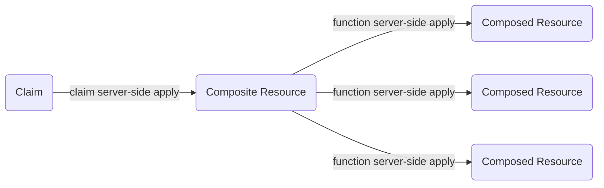

Crossplane can use server-side apply to sync claims with composite resources
(XRs), and to sync composite resources with composed resources.

When Crossplane uses server-side apply, the Kubernetes API server helps sync
resources. Using server-side apply makes syncing more predictable and less
buggy.


Server-side apply is a Kubernetes feature. Read more about server-side apply in
the [Kubernetes documentation](https://kubernetes.io/docs/reference/using-api/server-side-apply/).


## Disable server-side apply
<!-- vale write-good.Passive = NO -->
Server-Side Apply is a beta feature. Beta features are enabled by default.
<!-- vale write-good.Passive = YES -->

Disable server-side apply by disabling the `--enable-ssa-claims` feature flag.
Read the [Install Crossplane documentation]()
to learn about feature flags.

When server-side apply is disabled, you might see fields reappearing after you delete 
them from a claim's `spec`. Also, Crossplane doesn't delete labels and annotations from
the composite resource when you delete them from the claim.

## Use server-side apply to sync claims with composite resources

When you create a claim, Crossplane creates a corresponding composite resource.
Crossplane keeps the claim in sync with the composite resource. When you change
the claim, Crossplane reflects those changes on the composite resource.

Read the [claims documentation]() to learn more about claims
and how they relate to composite resources.

Crossplane can use server-side apply to keep the claim in sync with the
composite resource.


With server-side apply, Crossplane is stricter about how it syncs
a claim with its counterpart composite resource:

- The claim's `metadata` syncs to the composite resource's `metadata`.
- The claim's `spec` syncs to the composite resource's `spec`.
- The composite resource's `status` syncs to the claim's `status`.

With server-side apply Crossplane doesn't sync the composite resource's `metadata`
and `spec` back to the claim's `metadata` and `spec`. It also doesn't sync the
claim's `status` to the composite resource's `status`.


## Use server-side apply to sync claims end-to-end

To get the full benefit of server-side apply, use it together with composition functions.

When you use composition functions, Crossplane uses server side apply to sync
composite resources with composed resources. Read more about this in the
[composition functions documentation]().

When you use server-side apply end-to-end there is a clear, predictable
propagation of fields from claim to composed resources, and back:

* `metadata` and `spec` flow forwards, from claim to XR to composed resources.
* `status` flows backwards, from composed resources to XR to claim.


When you use composition functions, Crossplane is stricter about how it syncs
composite resources (XRs) with composed resources:

- The XR's `metadata` syncs to the composed resource's `metadata`.
- The XR's `spec` syncs to the composed resource's `spec`.
- The composed resource's `status` syncs to the XR's `status`.

When you use composition functions Crossplane doesn't sync the composed resource's `metadata`
and `spec` back to the XR's `metadata` and `spec`.


When Crossplane uses server-side apply end-to-end to sync claims with composed
resources, it deletes fields from a composed resource's `spec` when you
delete fields from the claim's `spec`.

When Crossplane uses server-side apply end-to-end it's also able to merge claim
fields into complex composed resource fields. Objects and arrays of objects are
examples of complex composed resource fields.


Crossplane can only merge complex fields for resources that use server-side
apply merge strategy OpenAPI extensions. Read about these extensions in the
Kubernetes [server-side apply documentation](https://kubernetes.io/docs/reference/using-api/server-side-apply/#merge-strategy).

If you find that Crossplane isn't merging managed resource fields, raise an
issue against the relevant provider. Ask the provider maintainer to add
server-side apply merge strategy extensions to the managed resource.
