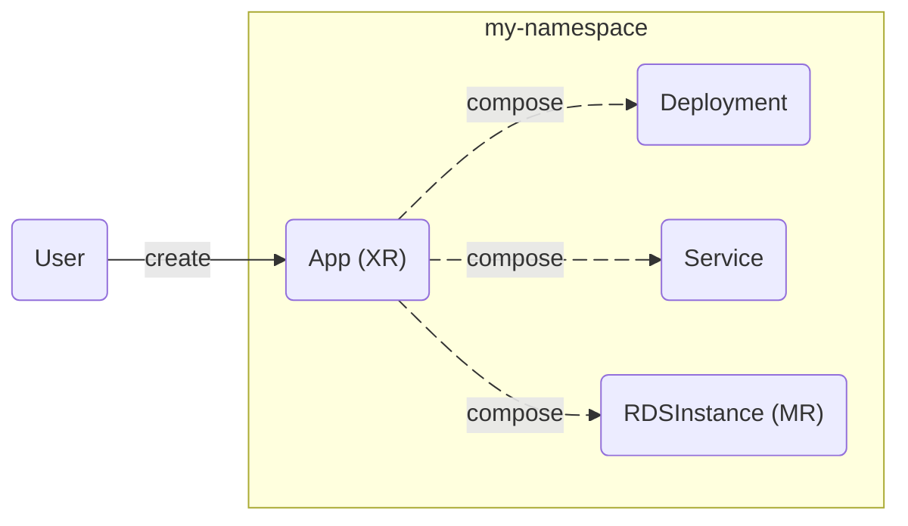
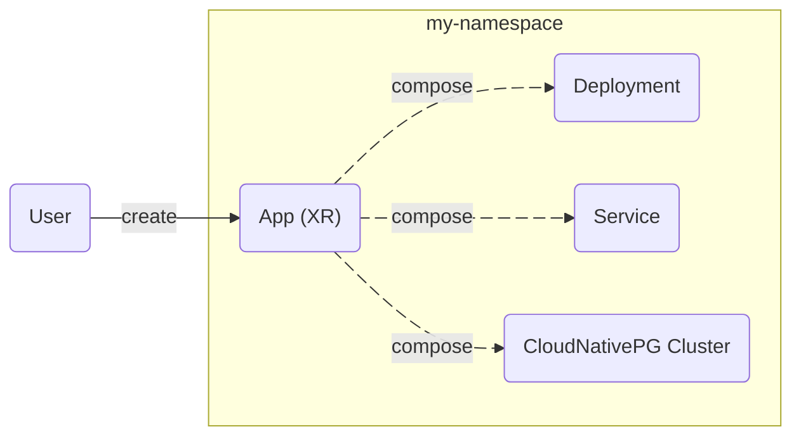

**Crossplane v2 makes Crossplane more useful, more intuitive, and less
opinionated.**

Crossplane v2 makes three major changes:

* **Composite resources are now namespaced**
* **Managed resources are now namespaced**
* **Composition supports any Kubernetes resource**

**Crossplane v2 is better suited to building control planes for applications,
not just infrastructure.** It removes the need for awkward abstractions like
claims and provider-kubernetes Objects.




Most users can upgrade to Crossplane v2 without breaking changes.

Read about Crossplane v2's [backward compatibility](#backward-compatibility).



This page assumes you're familiar with Crossplane. New to Crossplane? Read
[What's Crossplane]() instead.



## Namespaced composite resources

Crossplane v2 makes composite resources (XRs) namespaced by default.

A namespaced XR can compose any resource ([not just Crossplane resources](#compose-any-resource))
in its namespace.

A namespaced XR looks like this:

```yaml
apiVersion: example.crossplane.io/v1
kind: App
metadata:
  namespace: default
  name: my-app
spec:
  image: nginx
  crossplane:
    compositionRef:
      name: app-kcl
    compositionRevisionRef:
      name: app-kcl-41b6efe
    resourceRefs:
    - apiVersion: apps/v1
      kind: Deployment
      name: my-app-9bj8j
    - apiVersion: v1
      kind: Service
      name: my-app-bflc4
```


Crossplane v2 moves all an XR's "Crossplane machinery" under `spec.crossplane`.
This makes it easier for users to tell which fields are important to them, and
which are just "Crossplane stuff" they can ignore.


Composite resource definitions (XRDs) now have a `scope` field. The `scope`
field defaults to `Namespaced` in the new v2alpha1 version of the XRD API.

```yaml
apiVersion: apiextensions.crossplane.io/v2alpha1
kind: CompositeResourceDefinition
metadata:
  name: apps.example.crossplane.io
spec:
  scope: Namespaced
  group: example.crossplane.io
  names:
    kind: App
    plural: apps
  versions:
  - name: v1
  # Removed for brevity
```

You can also set the `scope` field to `Cluster` to create a cluster scoped XR. A
cluster scoped XR can compose any cluster scoped resource. A cluster scoped XR
can also compose any namespaced resource in any namespace.

With namespaced XRs there's no longer a need for claims. **The new namespaced
and cluster scoped XRs in Crossplane v2 don't support claims.**


Crossplane v2 is backward compatible with v1-style XRs.

When you use v1 of the XRD API `scope` defaults to a special `LegacyCluster`
mode. `LegacyCluster` XRs support claims and don't use `spec.crossplane`.

Read more about Crossplane v2's [backward compatibility](#backward-compatibility).


## Namespaced managed resources

Crossplane v2 makes all managed resources (MRs) namespaced.

This enables a namespaced XR to by composed entirely of namespaced resources -
whether they're a Crossplane MR like an `RDSInstance`, a Kubernetes resource
like a `Deployment`, or a third party custom resource like a
[Cluster API](https://cluster-api.sigs.k8s.io) `Cluster`.

A namespaced MR looks like this:

```yaml
apiVersion: s3.aws.m.upbound.io/v1beta1
kind: Bucket
metadata:
  namespace: default
  generateName: my-bucket
spec:
  forProvider:
    region: us-east-2
```

Namespaced MRs work great with or without composition. Crossplane v2 isn't
opinionated about using composition and MRs together. Namespaces enable fine
grained access control over who can create what MRs.


During the Crossplane v2 preview only namespaced AWS managed resources are
available.

<!-- vale gitlab.FutureTense = NO -->
Maintainers will update the managed resources for other systems including Azure,
GCP, Terraform, Helm, GitHub, etc to support namespaced MRs soon.
<!-- vale gitlab.FutureTense = YES -->



Crossplane v2 is backward compatible with v1-style cluster scoped MRs.

<!-- vale gitlab.FutureTense = NO -->
New provider releases will support both namespaced and cluster scoped MRs.
Crossplane v2 considers cluster scoped MRs a legacy feature. Crossplane will
deprecate and remove cluster scoped MRs at a future date.
<!-- vale gitlab.FutureTense = YES -->

Read more about Crossplane v2's [backward compatibility](#backward-compatibility).


## Compose any resource

Crossplane v2 isn't opinionated about using composition together with managed
resources.

You can create a composite resource (XR) that composes any resource, whether
it's a Crossplane MR like an `RDSInstance`, a Kubernetes resource like a
`Deployment`, or a third party custom resource like a
[CloudNativePG](https://cloudnative-pg.io) PostgreSQL `Cluster`.



This opens composition to exciting new use cases - for example building custom
app models with Crossplane.

### Beware Crossplane's default access

Crossplane by default can only access a limited set of kubernetes resources beyond what gets configured by any providers.

To grant access to additional resource resource types, create additional `ClusterRoles` and include them in the default Crossplane `ClusterRole` through [aggregation](https://kubernetes.io/docs/reference/access-authn-authz/rbac/#aggregated-clusterroles). Crossplane's default ClusterRole aggregates using a selector for the label `rbac.crossplane.io/aggregate-to-crossplane: "true"`

If you don't include this you may experience RBAC issues composing third party custom resources.

Here is an example of allowing Crossplane handle the lifecycle of CloudNativePG PostgreSQL `Cluster`.

``` yaml
apiVersion: rbac.authorization.k8s.io/v1
kind: ClusterRole
metadata:
  name: cnpg:aggregate-to-crossplane
  labels:
    app: crossplane    
    rbac.crossplane.io/aggregate-to-crossplane: "true"
rules:
- apiGroups:
  - postgresql.cnpg.io
  resources:
  - clusters
  verbs:
  - "*"
```

## Backward compatibility

Crossplane v2 makes the following breaking changes:

* It removes native patch and transform composition.
* It removes the `ControllerConfig` type.
* It removes support for external secret stores.

Crossplane deprecated native patch and transform composition in Crossplane
v1.17. It's replaced by composition functions.

Crossplane deprecated the `ControllerConfig` type in v1.11. It's replaced by the
`DeploymentRuntimeConfig` type.

Crossplane added external secret stores in v1.7. External secret stores have
remained in alpha for over two years and are now unmaintained.


As long as you're not using these deprecated or alpha features, Crossplane v2 is
backward compatible with Crossplane v1.x.


<!-- vale gitlab.FutureTense = NO -->
Crossplane v2 supports legacy v1-style XRs and MRs. Most users will be able to
upgrade from v1.x to Crossplane v2 without breaking changes.

Existing Compositions will require minor updates to work with Crossplane v2
style XRs. A migration guide will be available closer to the final release of
Crossplane v2.
<!-- vale gitlab.FutureTense = YES -->